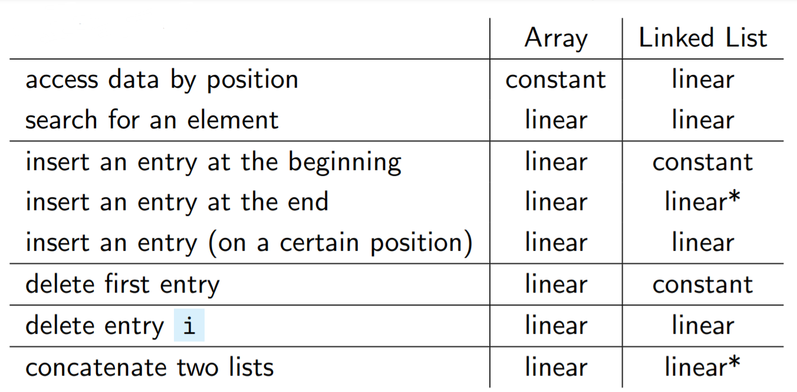
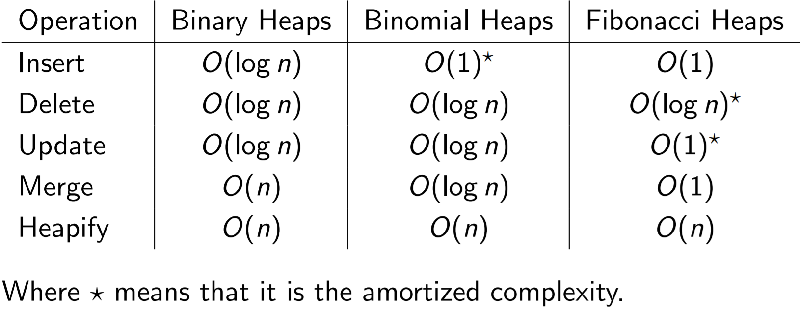
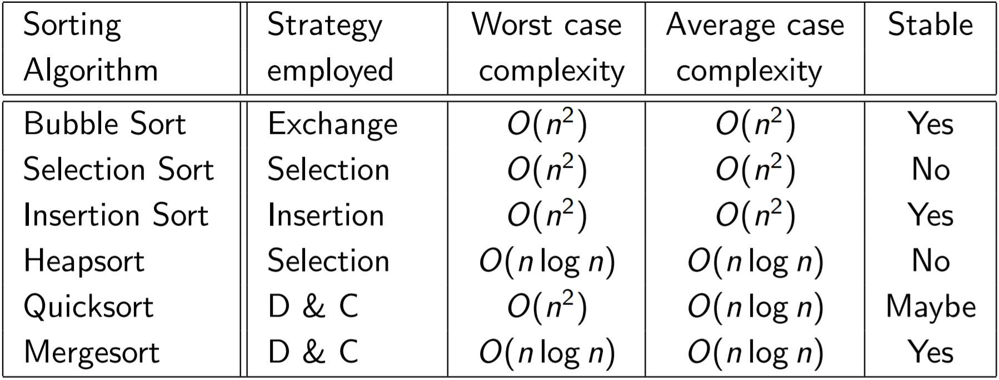
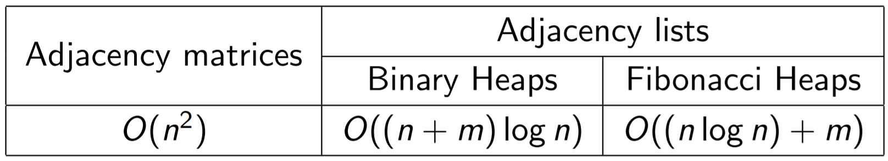

<h1> CheatSheet</h1>

08/01/2022
<a style="text-decoration:none; color: black;" href="https://github.com/KevinZonda">KevinZonda</a>

[TOC]

## Week 1: Array & LinkedList

## Week 2: ADT, Stack & Queue

**Abstract Data Types (ADT)**: 
- a type
- with associated operations
- whose representation is hidden to the user

**Stack:** a FILO ADT

**Queue**: A FIFO ADT

## Week 3: Complexity

### Notations

- **Upper Bound**
  - **Big-O**:  
    $f(n)=O(g(n))\Longleftrightarrow|f(n)|\leq|cg(n)| \\
    \text{for positive constants } c, n_0 \text{ where } n \gt n_0.$
  - **Little-o**:
    $f(n)=o(g(n))\Longleftrightarrow \lim_{n\rightarrow\infty}{\cfrac{f(n)}{g(n)}} \ \text{exists and is equal to 0.}$
- **Mix**
  - **Theta**:  
    $f(n)=\Theta(g(n))\Longleftrightarrow c_ig(n) \leq f(n)\leq c_2g(n)\\
    \text{positive constants}\ c_1, c_2, n_0 \text{ and } n \gt n_o$
- **Asymptotically Equal**
  - $f(n)\sim g(n) \Longleftrightarrow\lim_{n\rightarrow\infty}{\cfrac{f(n)}{g(n)}} \ \text{exists and is equal to 1.}$
- **Lower Bound**
  - **Big-Omega**:  
    $f(n)=\Omega(g(n)) \Longleftrightarrow |f(n)| \geq |cg(n)| \\
    \text{for positive constants } c, n_0 \text{ where } n \gt n_0.$
  - **Little-omega**:  
    $f(n)=\omega(g(n))\Longleftrightarrow \lim_{n\rightarrow\infty}{\cfrac{g(n)}{f(n)}} \ \text{exists and is equal to 0.}$

### Case Type

- **Average Case complexity**  
  = average complexity over all possible inputs/situations  
  (we need to know the likelihood of each of the input!) 
- **Worst Case complexity**  
  = the worst complexity over all possible inputs/situations
- **Best Case complexity**  
  = the best complexity over all possible inputs/situations 
- **Amortized complexity**  
  = average time taken over a sequence of consecutive operations 
## Week4: Trees

**Tree**: is a very flexible and powerful data structure that  has a hierarchical structure instead of the linear structure.

Number of child nodes that each node has:
- **0–1**: Unary trees (= Linked Lists)
- **0-2**: Binary trees
- **0–3**: Ternary trees
- **0-4**: Quad trees

### Terminology

- **Root**: the unique node at the base of the tree.
- **Edge**: The link connects each node to each of its child nodes.
- **Siblings**: Nodes with the same parent.
- **Leaf**: A node with no child nodes.
- **Path**: a sequence of connected edges between two nodes.
- **Ancestor/Descendent** of a node: is the parent/child of the node or (inductively) the ancestor/descendent of that parent/child.
- **Depth/level** of a node: the length of the path from
the node to the root (root has level 0).
- **Height** of a tree: the length of the longest path from the root to a leaf.
- **Size** of a tree: the number of nodes in the tree.
- A tree with one node has *size* 1 and *height* 0.
- An empty tree (with no nodes) has *size* 0 and, by convention, a *height* of -1.

**Binary Search Tree**: a tree which is either empty or
1. values in the left subtree are smaller
than in the root
2. values in the right subtree are larger
than in the root
3. root’s left and right subtrees are also
Binary Search Trees

## Week 5: AVL Tree

**AVL Tree**: A Binary Search Tree when the balance at every node is either 1, 0 or −1.

Perfectly Balanced:  
Number of Nodes is $1+2+4+8+\cdots + 2^h=2^{h+1}-1$

**Fibonacci Trees**: Minimal AVL trees  
Size: $\text{size of }T_{h+2}= 1 +\text{size of }T_{h+1}+\text{size of }T_{h}$

$T_h+1=\text{fib}({h+3})$

## Week 6: B-/B+Tree

### Properties

A B-tree of order $m$ is a type of $n$-ary trees with some particularly nice properties:

- Every node has at most $m$ children
- Every non-leaf node, except the root, has at least $m/2$ children
- The root node, if it is not a leaf node, has at least $2$ children
- A non-leaf node with $c$ children, contains $c−1$ search key values, which act as separators or discriminators, to guide searches down appropriate sub-trees
- All leaf nodes appear in the same level
- B-Trees are always height balanced
- Update and search is $O(\log n)$

### Variants

- **Record-Embedded B+ Tree**
- **Index B+ Tree**
  - **Primary Index B+Tree**
    - Data is in record file only
  - **Secondary Index B+Tree**
    - Data is in record file and leaf nodes also

**Bulk Loading**

1. Sort
2. Construct leaf blocks, parent node
3. When node full, split

## Week 7: Priority Queue

**Complete Binary Tree (CBT)**: a binary tree in which every level, except possibly the last, is completely filled, and all nodes are as far left as possible.

**Binary Heap Tree**: A binary heap tree is a complete binary tree which is either empty or satisfies the following conditions:
1. The priority of the root is greater than or equal to that of its children.
2. The left and right subtrees of the root are heap trees.

**Binomial Tree**: is defined recursively as follows:
-  A binomial tree of order $0$ is a single node.
-  A binomial tree of order $k$ has a root node with children that are roots of binomial trees of orders $k−1$, $k−2$,..., $2$, $1$, $0$

**Binomial Heap**: is a list of Binomial Trees with the properties:
- There can be only zero or one Binomial Trees of each order
- Each Binomial Tree satisfies the priority ordering property:
  - Each node has priority less than or equal to its parent.

Binomial Heap usually is implemented by double linked list.

## Week 8: Sorting

### Strategies

- Enumeration
- Exchange
- Selection
- Insertion
- Divide and conquer

## Week 9: Hash Table

- Hash Collision
  - Chaining Strategy
  - Open Addressing Strategy
    - Linear Probing
    - Double Hashing
      - Avoid Short Cycles
        - Let T = Prime
        - Let $T = 2^k$ and `Hash2(key)` always produces odd.
- High Load Factor
  - Rehashing

## Week 10: Graph

**Graph**: is formed of a (finite) set of vertices/nodes and a set of
edges between them.

Weighted/Unweighted  
Directed/Undirected

- **Node/Vertex**: Same as in Maths' Vertex
- **Digraph**: directed graph
- **Simple** graph: a graph  is called *simple* if
  1. it has no self loops, i.e. edges connected at both ends to the same node, and
  2. it has no more than one edge between any pair of nodes
- **Path** is a sequence of vertices
- **Cycle**: is a non-empty path whose first vertex is the same as
its last vertex.
- **Simple** path: if no vertex appears on it twice (except for a
cycle, where the first and last vertex may be the same)
- **Connected** undirected graph: if every pair of vertices has a path connecting them.
- A directed graphs is:
  - **Weakly Connected**: if for every two vertices A and B there is either a path from A to B or a path from B to A.
  - **Strongly Connected**: if there are paths leading both ways.
- Two vertices A and B connected by an edge *e* are called
**neighbours**, and *e* is said to be **incident** to A and B.
- Two edges with a vertex in common are said to **be adjacent**.

## Complexity

- **Binary Search Tree**
  - Search  
    Avg. O(log2 n)  
    Worst. O(n)
  - Insert
    Avg. O(log2 n)
  - Delete
    Avg. O(log2 n)
- **AVL Tree**  
  Insert, Dele, Search: O(log n)
- **B-/B+ Tree**
  - Update, Search: O(log n)
- **Priority Queue**
  - **Unsorted Array**  
    Insert: O(1)  
    Get: O(n)
  - **Sorted Array**  
    Insert: O(n)  
    Get: O(1)
  - **AVL Tree**  
    Insert: O(log n)  
    Get: O(log n)
  - Different Implements  
    
- **Hash Table**  
  Insert, Dele, Search: O(1)
- **Sorting**
  
- **Dijkstra & Prim**  
  