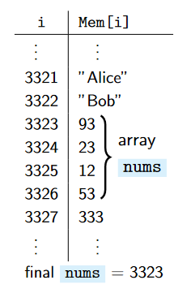

# Array/数组

<center>
<span>09/10/2021</span>
<a style="text-decoration:none; color: black;" href="https://github.com/KevinZonda">KevinZonda</a>
</center>

## Construct

```java
final int[] nums = new int[4];
```
in OS++

```c
final nums = allocate_memory(4*1);
```




## Operate

```java
x = nums[3];
numds[3] = 4;
```

OS++

```c
x = Mem[nums + 3];
Mem[nums + 3] = 4;
```

## Memory Management/内存管理

- Java
  - memory allocation is automatic
  - freeing memory is automatic (by the garbage collector)
  - bounds of arrays are checked
- In C or C++
  - allocations is explicit (similar to OS++ and Mem[-])
  - freeing memory is explicit (similar to OS++ and Mem[-])
  - bounds are not checked

Java is slower and safe, C (or C++) is fast and dangerous.
