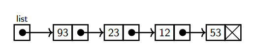
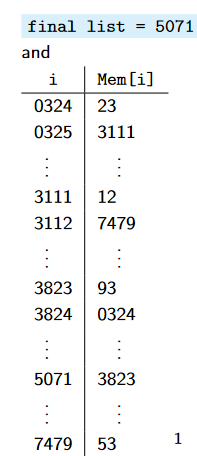
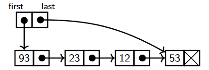
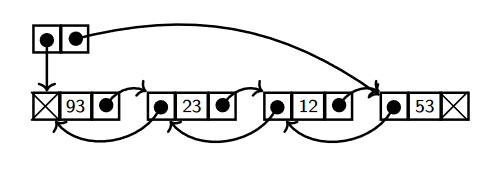
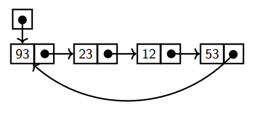
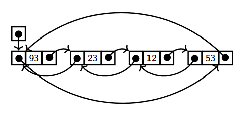

# Linked Lists/链表

09/10/2021
<a style="text-decoration:none; color: black;" href="https://github.com/KevinZonda">KevinZonda</a>

## In Memory

## Comparison

If we store a list of `n` elements as an array (without spare space)or a linked list, what costs will the basic operations of lists have asa function of the number of elements in the list (when the list is seen as an ADT)?

| Situation | Array | Linked List |
| --------- | ----- | ----------- |
| access data by position search for an element | constant linear | linear linear |
insert an entry at the beginning insert an entry at the end insert an entry (on a certain position) | linear linear linear | constant linear* linear |
| delete first entry | linear | constant |
| delete entry `i` | linear | linear |
| concatenate two lists | linear | linear* |

\* means could be improved to constant time if we modified.

## Modifications

### Pointer to the last node

Linked list with a pointer to the last node:

- Fast `insert_end`
- Slow `delete_end`

### Doubly Linked List

### Circular Singly Linked List

### Circular Doubly Linked List

