# Graph/图

<center>
<span>07/01/2022</span>
<a style="text-decoration:none; color: black;" href="https://github.com/KevinZonda">KevinZonda</a>
</center>

图是一个有限的节点集合,并用边连接他们

## Types


## Concepts

- 在数学，使用 Vertex,在CS使用 Node 和 Vertex
- 无向图，通常可以认为节点 u 和 节点w之前的边可以认为 u → w 和 w→ u
- 有向图被称为 digraph
- 一个图被称为 simple 如果
  1. 没有自环
  2. 一对节点最多有一条边
- 路径（path）是节点的数列,例如 v1, v2, v3, ..., vn,其中vi和vi+1是由边连接的
- 环（cycle）是一个首位节点相同的非空路径
- 一个路径是 simple，如果没有节点重复出现（除非是一个cycle）
- 一个无向图是 connected，如果每一对节点都有路径链接它们
- 一个有向图是
  - weakly connected，如果一对节点 A,B 其中由任意一个路径连接（A → B 或 B → A，有一个即可）
  - strongly connected，如果存在 A → B 且存在 B → A
- 一个树（tree）可以被视作一个没有环的 simple connected 的图，其中有一个节点被定义为 root
- 一个图，没有根节点，所以不存在 parent 也没有 children
- 两个节点 A, B，由边 e 连接着，则称两个节点为邻居（neighbours），边 e 可以认为 be incident to A and B
- 两条由一个共同节点的边称它们 adjacent （邻近的）

## Representation

### Adjacency Matrix/邻接矩阵

假设图的节点被记录为 $V = \left\{0, 1, 2, \cdots, n-1 \right\}$。

Adjacency Matrix（邻接矩阵）`G` 是一个 n × n 的 2D 数组/矩阵。  
`G[v][w]` 包含了节点 v 到 节点 w 之间连接的信息。

Unweighted graphs（非加权图）：
- `G[v][w] = 1` 表示节点 v 和 节点 w 之间存在一条边
- `G[v][w] = 0` 表示节点 v 和 节点 w 之间不存在任何边

Weighted graphs（加权图）：
- `G[v][w] = w` 表示节点 v 和 节点 w 之间存在一条边，且边的权重为 w
- `G[v][w] = ∞` 表示节点 v 和 节点 w 之间不存在任何边
- `G[v][v] = 0`\*

如果是无向图，那对于任何节点 v 和 w 都存在 `G[v][w] = G[w][v]`。

\* 根据应用，其他可能存在的值

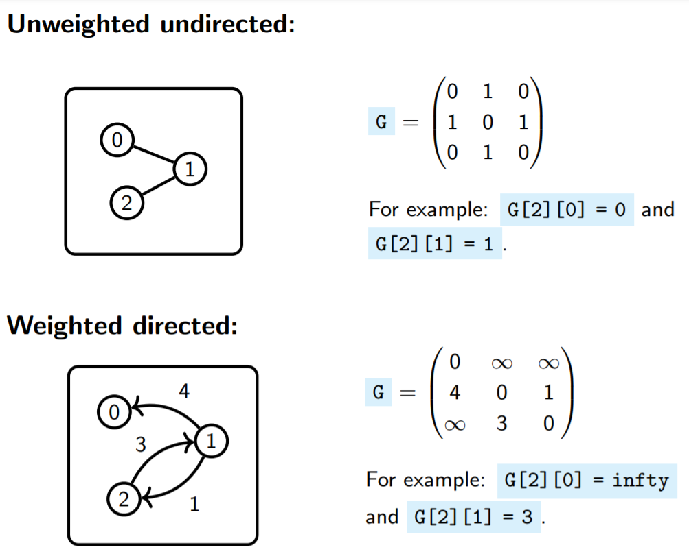

```
    0 1 2
0 | 0 ∞ ∞ |
1 | 4 0 1 |
2 | ∞ 3 0 |

1→0: 4
1→2: 1
2→1: 3

对于此矩阵，我们可以按行读：
      0 1 2
+---+-------+
| 0 | 0 ∞ ∞ |
+---+-------+   + 1→0: 4
| 1 | 4 0 1 | <-+ 1→1: 0 // G[v][v]
+---+-------+   + 1→2: 1
| 2 | ∞ 3 0 |
+---+-------+
```


### Adjacency List/邻接表

假设图的节点被记录为 $V = \left\{0, 1, 2, \cdots, n-1 \right\}$。

我们有一个 n-多（n-many）个链表。

Unweighted graphs（非加权图）：
- `N[v]` 是 `v` 的邻居  
  `w` 是 `v` 的邻居，如果存在一个边 `v` → `w`

Weighted graphs（加权图）：
- `N[v]` 是 `v` 的邻居与连接它们边的权重

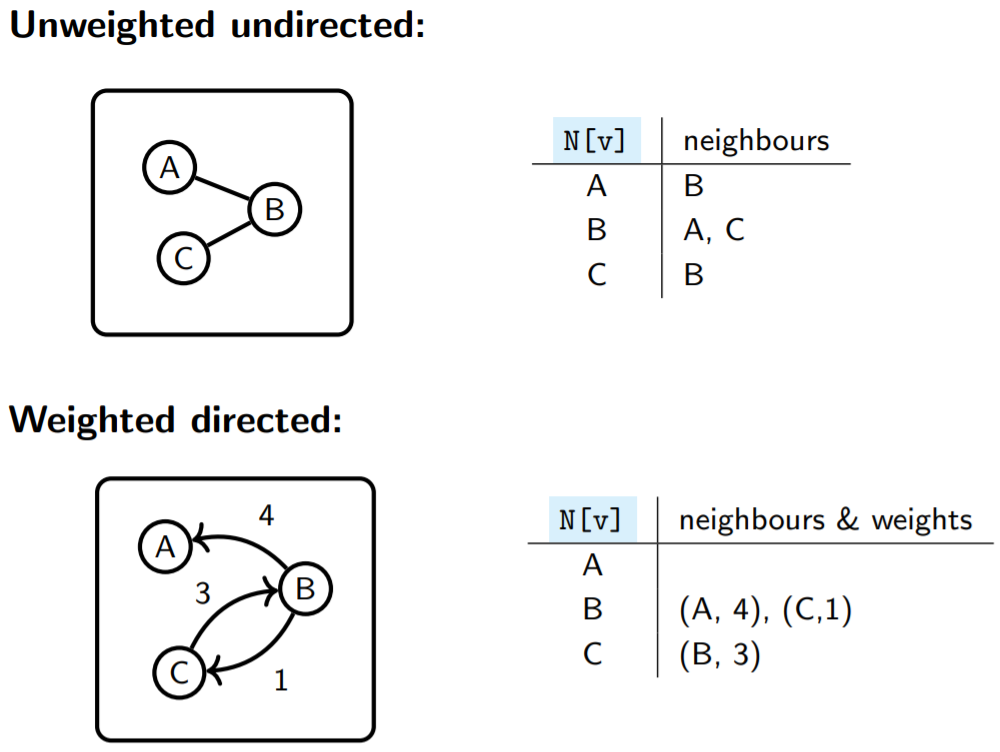

### Comparison/对比

n：节点的数量  
m：边的总数

|                  | Adjacency Matrix                       | Adjacency List               |
| ---------------- | -------------------------------------- | ---------------------------- |
| 是否存在边 v → w | 读 `G[v][w]`                            | 检查 `w` 是否能存在于 `N[v]`  |
| 分配的空间       | 需要 O(n x n)                           | O(n+m)                       |
| 遍历 `v` 的邻居  | 遍历的 `G[v][v]` 的所有元素，需要 O(n)    | 只遍历 `N[v]` 链表            |

在第三个 case （with adjacency lists）下，我们只遍历了 `v` 的实际邻居。只要图是稀疏的（=不是密集的），也就是说，如果有相对较少的边，这就比较好。

Sparse graph（稀疏图）：|E| 远小于 |V|^2  
Dense graph（稠密图）：|E| 接近 |V|^2  
简单来说边越多，图就越稠密

如果 边的总数 是 O(节点的数量) 或更少，而不是 O(节点的数量^2) ，那么这个图就是稀疏的。

检查是否存在一个边，则 Matrices 比 Lists 快  
如果图是稀疏的，那么分配给 List 的空间会小于 Matrices，并且在遍历 neighbours 时，List 也比 Matrices 快。

## Shortest Path/最短路径

是使从 起始点 A 到 目标点 B 中 路径（path）权重的和最小的路径。

需要注意，可能存在不同的最短路径，非加权图，则每个边权重为 1

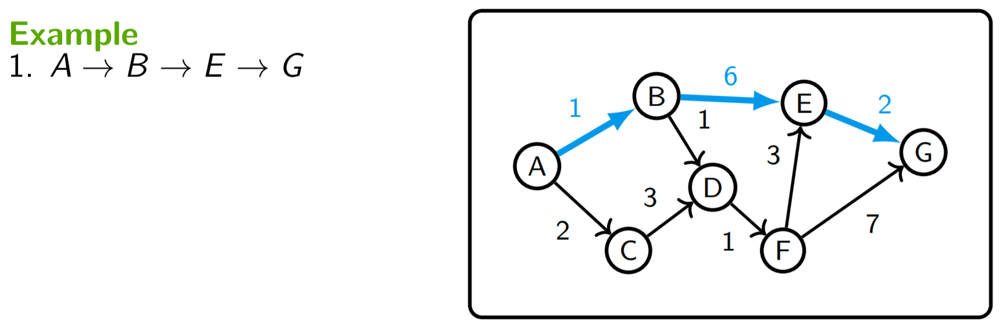
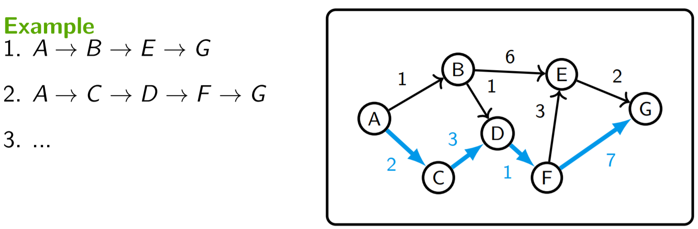
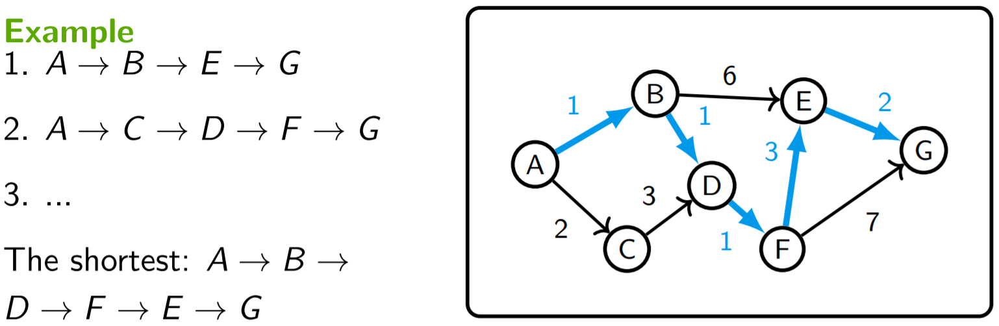

## Dijkstra's Algorithm

对于每个节点 w 和另一个节点 v，我们持续记录：
- `d[w]=` 目前从 v 到 w 的最短路径的权重和  
  起始为 ∞，除非 `d[v]=0`
- `p[w]=` 到 v 的最短路径上的前一个节点（aka 前任，predecessor）  
  起始为 `w`
- `f[w]=` 计算 `d[w]`是否完成
  起始为 false

### 思路

```
1: set d[v] = 0 (i.e. start on v )
2:     while there are unfinished vertices:
3:         set w = the yet unfinished vertex with the smallest d[w]
4:         set f[w] = true (i.e. mark w as finished)
5:         for every neighbour u of w :
6:             if d[w] + weight(w,u) < d[u] :
7:                 set d[u] = d[w] + weight(w,u) and p[u] = w
```

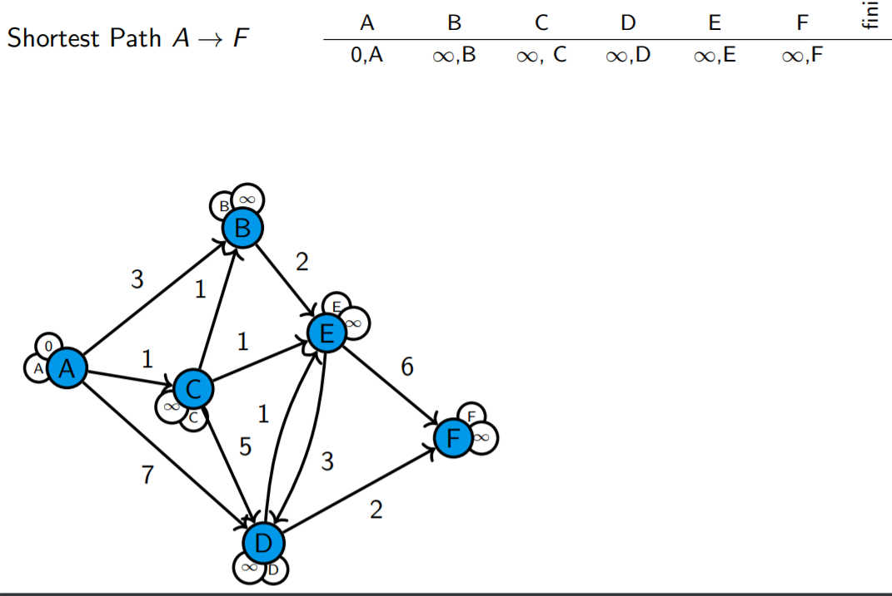
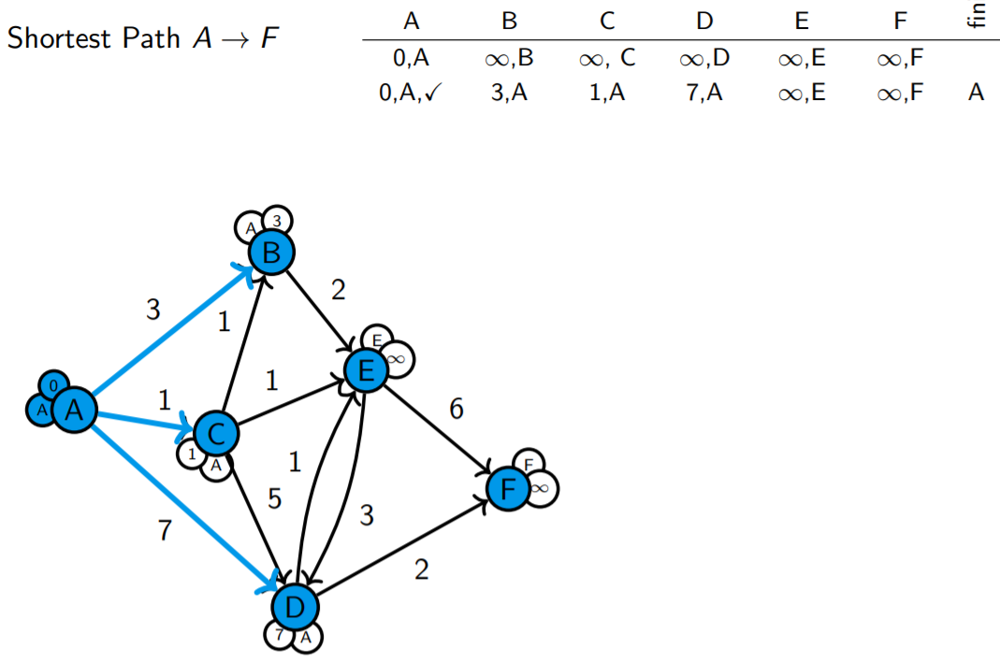

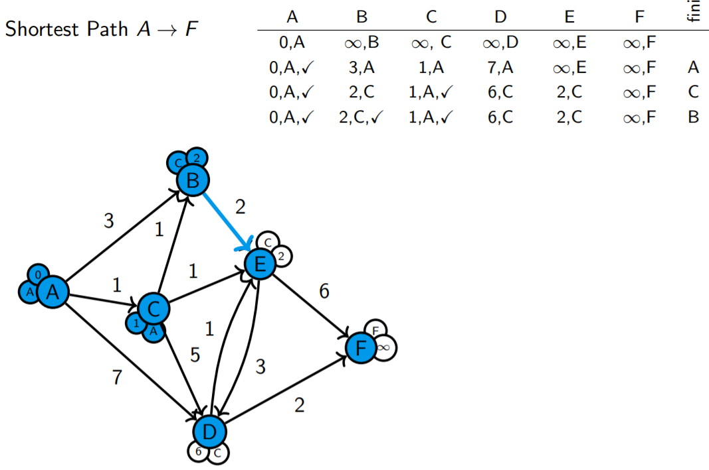
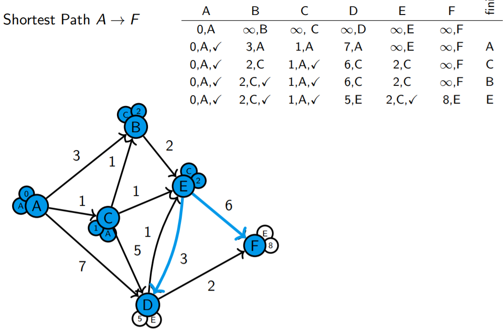

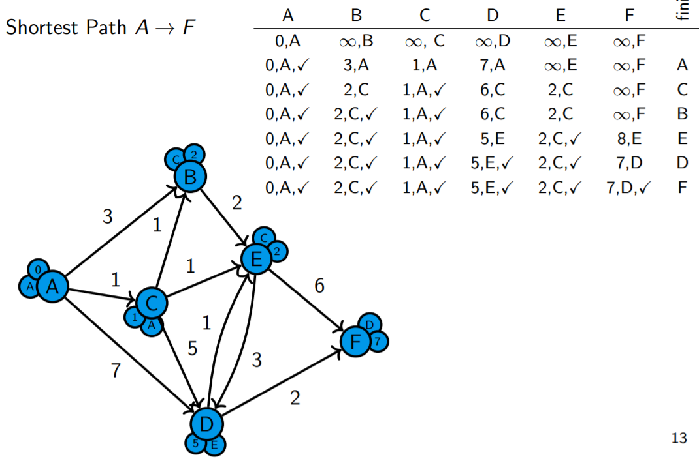


### 时间复杂度

n: 节点数量
m: 边的总数

我们进行了 n 次：
1. 标记 `w` 为已完成
2. 记录 `w` 的另据
3. 寻找 `w` 是否未完成，并且寻找最小的 `d[w]`

#### Adjacency Matrix

使用 adjacency matrix 表示，其由 n 个外循环，所以需要

- 步骤 1：O(n)
- 步骤 2：O(n^2)
- 步骤 3：穿过全部节点，O(n^2)

因此复杂度为 o(N^2)

#### Adjacency List

使用最小优先级队列：u的优先级为 d[u]

- 初始化队列：插入节点
- 调用 `deleteMi` 去寻找未完成的的最小 `d[w]` 的节点
  - 每次迭代，执行一次，因此执行了最高 n 次
- `d[u]` 改变，我们更新 `u` 的优先级

步骤 c 的总计时间复杂度为 O(n x deleteMin 的消耗 + m x update 的消耗)

- 使用二叉堆：O(n log n+m log n)
- 使用斐波那契堆：O(n log n+m)

分析中省略了初始化堆的时间复杂性。这通常是由 heapify 完成的，对于我们所有的堆，其时间复杂度总是 O(n)。另外，我们可以做 n 次插入，这将导致时间复杂度为O(n log n)或O(n)，取决于我们使用的堆的类型。无论哪种方式，初始化都不会对总的时间复杂度产生任何影响。

#### 对比

| Adjacency Matrix | Adjacency List | Adjacency List |
| --- | --- | --- |
| | 二叉堆 | 斐波那契堆 |
| O(n^2) | O((n + m) log n) | O((n log n) + m) |

小优先级队列：
- 二叉堆： `update` 和 `deleteMin` 均为 O(log n)
- 斐波那契堆：`update` 是 O(1) 而 `deleteMin` 是 O(log n) （均摊时间）

**注意：** dijkstra算法直在权重 >= 0 工作。

**备注:** 如果图是密集的，也就是说，如果边的数量 m 大约是 $n^2$，那么使用邻接列表和二进制堆的时间复杂度是 $O((n + n^2) \log n) = O(n^2 \log n)$，比仅仅使用邻接矩阵要慢。当使用斐波那契堆时，这个问题就消失了，对于密集图，时间复杂度变成了$O(n \log n + n^2) = O(n^2)$。
另一方面，如果图不是密集的，使用邻接列表与二叉堆或斐波那契堆比使用邻接矩阵更快。

#### 实现

With Matrix:

```csharp
public static void Dijkstra(int[][] G, int v, int z)
{
    int n = G.Length;
    int[] d = new int[n];
    int[] p = new int[n];
    bool[] f = new bool[n];

    for (int w = 0; w < n; ++w)
    {
        d[w] = int.MaxValue / 2;
        p[w] = w;
        f[w] = false;
    }
    d[v] = 0;

    while (true)
    {
        w = MinUnFinished(d, f);
        if (w == -1)
            break;
        
        for (int u = 0; u < n; ++u)
        {
          Update(w, u, d, p);
        }
        f[w] = true;
    }
    return ComputeResult(v, z, G, d, p);

}

public static int MinUnfinished(int [] d, bool[] f)
{
    int min = int.MaxValue / 2;
    int idx = -1;

    for (int i = 0; i < d.Length; ++i)
    {
        if (!f[i] && d[i] < min)
        {
            min = d[i];
            idx = i;
        }
    }
    return idx;
}

public static void Update(int[] w, int[] u, int[] G, int[] d, bool[] p)
{
    if (d[w] + G[w][u] < d[u])
    {
        d[u] = d[w] + G[w][u];
        p[u] = w;
    } 
}

```

With List:


```csharp
public class Edge
{
    public int Target { get; set; }
    public int Weight { get; set; }
}

public static void Dijkstra(List<Edge>[] N, int v, int z)
{
    int n = N.Length;
    int[] d = new int[n];
    int[] p = new int[n];
    PriorityQueue<int, int> Q = new();

    for (int w = 0; w < n; ++w)
    {
        d[w] = int.MaxValue / 2;
        p[w] = w;
        Q.Enqueue(w, d[w]);
    }

    d[v] = 0;

    {
        PriorityQueue<int, int> t;
        Q.Update(v, 0, out t);
        Q = t;
    }

    while (Q.Count > 0)
    {
        int w = Q.Dequeue();

        foreach (Edge e in N[w])
        {
            int u = e.Target;
            if (d[w] + e.Weight < d[u])
            {
                d[u] = d[w] + e.Weight;
                p[u] = w;

                PriorityQueue<int, int> t;
                Q.Update(u, d[u], out t);
                Q = t;
            }
        }
    }
    ComputeResult(v, z, N, d, p);
}
```

## Minimal Spanning Tree (MST)/最小生成树

**生成树：** 无向图 G 的生成树是具有 G 的全部顶点，但边数最少的连通子图。

**MST：** 是指生成树中权重最小的那一颗

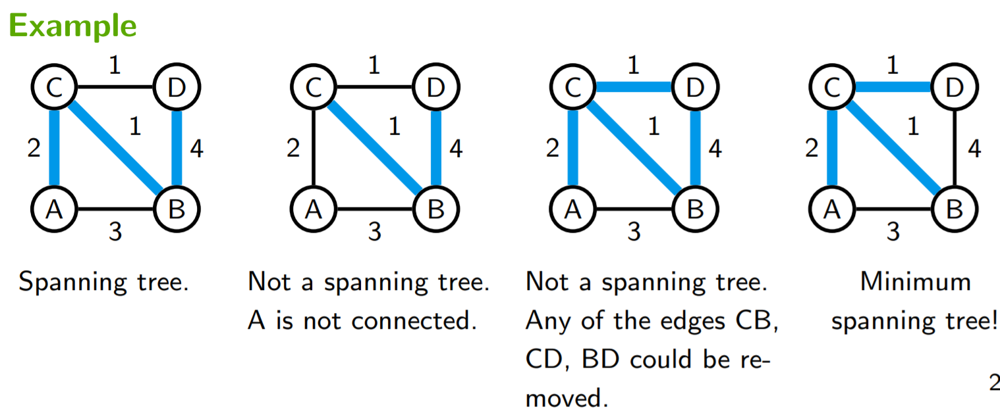

## Prim 算法

思路：使用一个最小权重边延申这个树

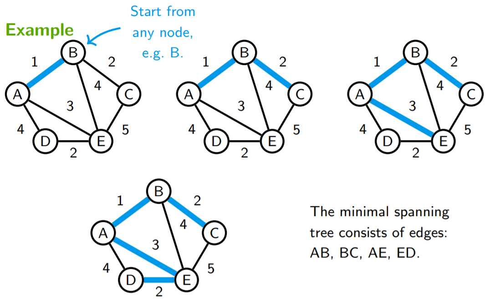

对于图中任何节点 `w`，我们保持追踪：
- `d[w]=` 当前到树的距离  
  起始为 ∞，除非 `d[v]=0`
- `p[w]=` 连接到树的节点  
  起始为 `w`
- `f[w]=` 计算 `w`是否被添加到树中  
  起始为 false


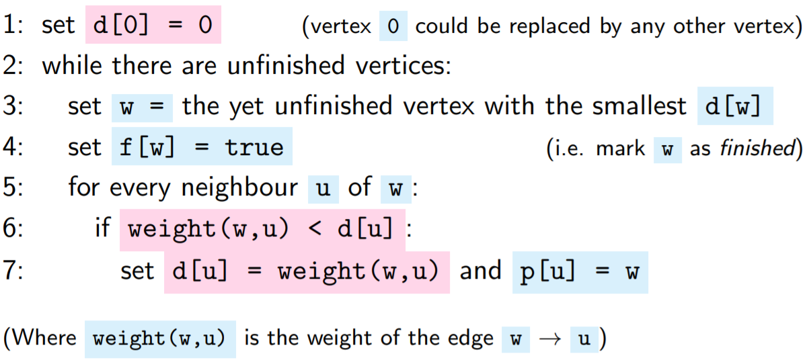

其与 Dijkstra 思路类似，红色为其差异性。

### 复杂度

其复杂度与 Prime 一致。


与此同时，其可以作用于负权重图。
