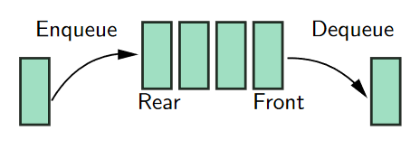
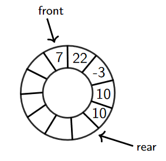
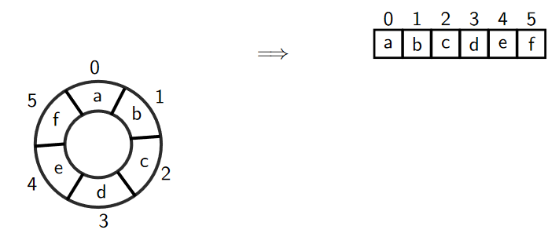
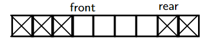
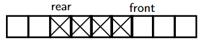

# Queue/队列

FIFOs, First-In-First-Out#

## ADT

- `enqueue(x)`
- `dequeue`
- `is_empty()`



If try to dequeue from an empty queue, will get `EmptyQueueException`.

## Implementation

### By Array

Whenever `enqueue` (resp. `dequeue`) we increment `rear` (resp. `front`).



#### Representing circles



```
pos = (pos + 1) % 6
```

To generalise:

```
pos = (pos + 1) % size
```

#### Circular Queue

```csharp
var queue = new int[MAXQUEUE];
int front = 0;
int size = 0;
```

- `font + size <= MAXQUEUE`  
`pos` ∈ [font, font + size)  

- `font + size > MAXQUEUE`  
`pos` ∈ [font, MAXQUEUE) ∪ [0, front + size - MAXQUEUE)


- `font` ∈ [0, MAXQUEUE)
- `size` ∈ [0, MAXQUEUE]

`rear = (front + size) % MAXQUEUE`

if `size == MAXQUEUE`, the queue is full.

##### Enqueue

1. Is not full?
2. Insert data into index `(front + size) % MAXQUEUE`
3. Add 1 to `size`

##### Dequeue

1. Is not empty?
2. Get value at index `front`
3. `front = (front + 1) % MAXQUEUE`
4. Minus 1 to `size`