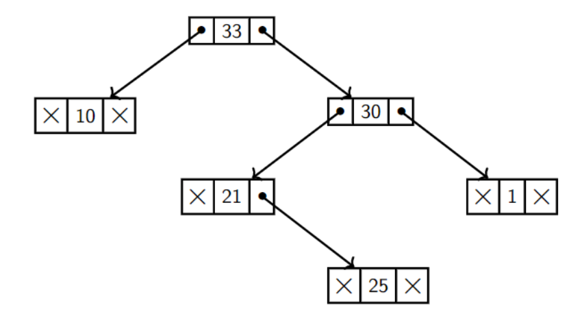
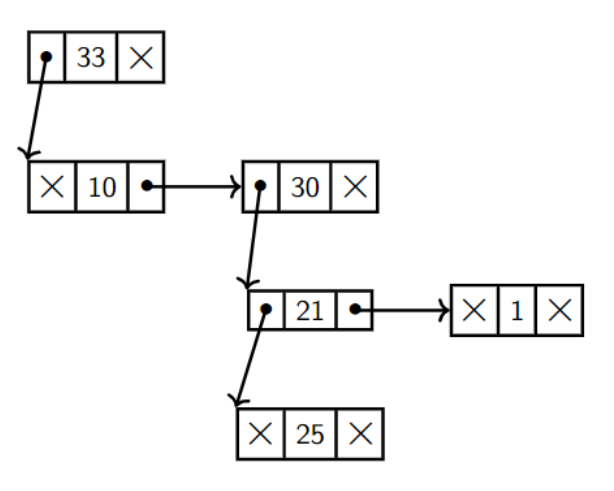
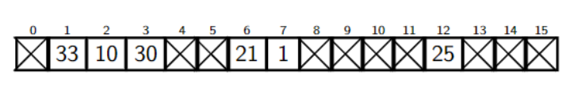

# Tree/树

<center>
<span>16/11/2021</span>
<a style="text-decoration:none; color: black;" href="https://github.com/KevinZonda">KevinZonda</a>
</center>

## Basic

树有不同的种类，其取决于树有多少子支

- 如果有 0~1 个孩子，则称为 Unary Tree，例如链表  
- 如果有 0~2 个孩子，则称为 Binary Tree
- 如果有 0~3 个孩子，则称为 Ternary Tree
- 如果有 0~4 个孩子，则称为 Quad Tree

其中 Size 是节点的数量  
Height 是从根节点（root）到叶子（leaf）的最长路径

```
     33  -------  0th level (root)
    /  \
  10    30  ----  1st level
       /  \
     21    1 ---  2nd level (leaves) 
```

- Root: 在树基上独特节点
- Edge：连接每个节点
- 每个child都只有一个父节点（parent）
- Siblings： 拥有相同父节点（parent）的节点
- Leaf：没有孩子的节点
- *ancestor*/*descendentof* a node is the *parent*/*child* of the node or (inductively) the *ancestor*/descendent of that *parent*/*child*.
- Path: 连接的边的序列

空树是 size = 0，或者说 height 为 -1


## Implement/实现

有三种实现树的方法：

- 基础：使用类似于双向链表一样的结构实现一个树
- Sibling List: 没看懂
- 数组模拟

### Basic



### Sibling List



### Array



## ADT

- Constructor
  - `EmptyTree()`
  - `MakeTree(value, left, right)`
- Accessor
  - `isEmpty(tree)`
  - `root(tree)`
  - `left(tree)`
- Convenience Constructor
  - `Leaf(v) = MakeTree(value, EmptyTree(), EmptyTree())`

### Some Code

#### Construct a Tree

```go
MakeTree(
    33,
    Leaf(10),
    MakeTree(30,
        MakeTree(21,
            EmptyTree(),
            Leaf(25)
        ),
        Leaf(1)
    )
)

```

Result:

```
   33
  /  \
10   30
    /  \
  21    1
    \
     25
```

### Reverse a tree

```go
func reverseTree(t) {
    if (isEmpty(t))
        return t
    else {
        return MakeTree(
            root(t),
            reverseTree(right(t)),
            reverseTree(left(t))
        )
    }
}
```

Result:

```
   33               33
  /  \             /  \
10   30          30    10
    /  \   ->   /  \
  21    1      1   21
    \             /
     25         25
```

### Flatten tree to list

```go
func flatten(t) {
    if (isEmpty(t))
        return []
    else {
        return append(
            flatten(left(t)),
            MakeList(
                root(t),
                flatten(right(t))
            )
        )
    }
}

```