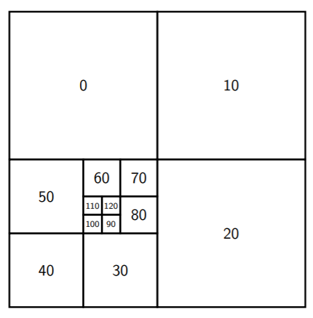

# Quad Trees/四叉树

<center>
<span>16/11/2021</span>
<a style="text-decoration:none; color: black;" href="https://github.com/KevinZonda">KevinZonda</a>
</center>

## Basic

- 值只存在叶节点，在中间的节点上没有值
- 内部节点有 4 个孩子

常用于表示 2 维数据，例如图像。典型引用是图像压缩。




## ADT

- Constructor
  - `baseQT`: returns a single, leaf node quad tree with a value
  - `MakeQT(luqt, ruqt, llqt, rlqt)`
- Accessors
  - `isValue(qt)`: 判断是不是 value node（叶子节点）
  - `lu(qt)`: left upper
  - `ru(qt)`: right upper
  - `ll(qt)`: left lower
  - `rl(qt)`: right lower

### Rotate

```go
func rotate(qt) {
    if (isValue(qt))
        return qt
    else {
        return makeQT(
            rotate(rl(qt)),
            rotate(ll(qt)),
            rotate(ru(qt)),
            rotate(lu(qt))
        )
    }
}
```