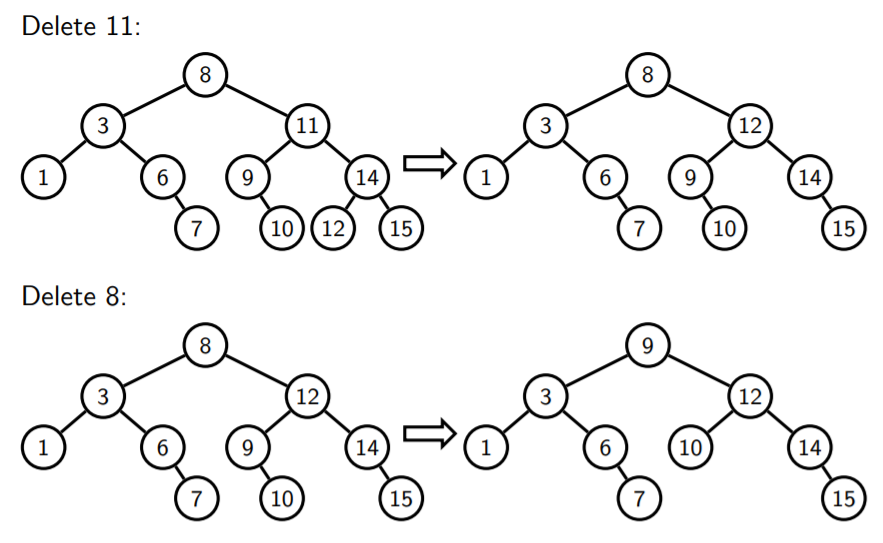

# Binary Search Tree/二叉查找树

<center>
<span>16/10/2021</span>
<a style="text-decoration:none; color: black;" href="https://github.com/KevinZonda">KevinZonda</a>
</center>

## Basic

BST 是一个树要么为空要么：

- 在左子树的值比在右子树的小
- 在右子树的值比在左子树的大
- 根节点的左右子树都为 BST

## Implement/实现

### Insertion/插入

```go
// v: value
// bst: a tree
func insert(v, bst) {
    if (isEmpty(bst))
        return MakeTree(v, EmptyTree, EmptyTree)
    else if (v < root(bst)>) {
        return MakeTree(
            root(bst),
            insert(v, left(bst)),
            right(bst)
        )
    } else if (v > root(bst)) {
        return MakeTree(
            root(bst),
            left(bst),
            insert(v, right(bst))
        )
    } else {
        error("Value is in BST")
    }
}
```

#### Java Programme

Basic:

```java
public class BST {
    private Node tree = null;

    private static class Node {
        public int val;
        public Node left, right;

        public Node(int val, Node left, Node right) {
            this.val = val;
            this.left = left;
            this.right = right;
        }
    }

    // Following code should be added at here
}

```

Insert:

```java
public void insert(int v) {
    if (tree == null)
        tree = new Node(v, null, null);
    else
        insert(v, tree);
}

private void insert(int v, Node ptr) {
    if (v < ptr.val) {
        if (ptr.left == null)
            ptr.left = new Node(v, null, null);
        else
            insert(v, ptr.left);
    } else if (v > ptr.val) {
        if (ptr.right == null)
            ptr.right = new Node(v, null, null);
        else
            insert(v, ptr.right);
    } else {
        throw new Exception("Value is in BST");
    }
}
```

### Searching/搜索

对于搜索 `x`，我们有3种情况

- 相等，我们找到了
- `x` <，我们搜索左子树
- `x` >，我们搜索右子树

By Recursively
```go
// v: Value
// t: Tree
func search(v, t) {
    if (isEmpty(t))
        return false
    else if (v == root(t))
        return true
    else if (v < root(t))
        return search(v, left(t))
    else
        return search(v, right(t))
}
```

By Iteratively
```go
// v: Value
// t: Tree
func search(v, t) {
    while (
        (!isEmpty(t)) &&
        (v != root(t))
    ) {
        if (v < root(t))
            t = left(t)
        else
            t = right(t)
    }
    return (!isEmpty(t))
}
```

#### Complexity Analysis/复杂度分析

```
1            
 \           
  2               4
   \            /   \
    3    vs    2     6
     \        / \   / \
      4      1   3 5   6
       \     
       ...
```

搜索复杂度
- Left: $O(n)$
- Right: $O(\log_2{n})$
- Average: $O(\log_2{n})$

平均高度为 $O(\sqrt{n})$

### Deleting/删除

- 第一个选项
  - 插入项目除了需要删除的进入一个新 BST
  - 插入 $n$ 个的复杂度为 $O(\log_2{n})$，最终复杂度为 $O(n\log_2{n})$
  - 最差情况是从一个数组中删除：$O(n)$
- 第二个选项
  - 查找一个包含元素的节点
  - 如果是叶子节点，则删除
  - 如果不是，如果是一个节点，并且其孩子非空，用这个非空子树的根节点替换这个节点
  - 否则
    - 查找右子树最左侧的节点
    - 用最左边的节点的值替换要删除的值
    - 将最左边的节点替换为其右边的子节点（可能是空的）
  - 复杂度 $O(\log_2{n})$



```go
// v: Value
// t: Tree
func delete(v, t) {
    if (isEmpty(t))
        error ("Is not in BST")
    else {
        if (v < root(t)) {
            return MakeTree(
                root(t),
                delete(v, left(t)),
                right(t)
            )
        }
        else {
            if (isEmpty(left(t)))
                return right(t)
            else if (isEmpty(right(t)))
                return left(t)
            else {
                return MakeTree(
                    smallestNode(right(t)),
                    left(t),
                    removeSmallestNode(right(t))
                )
            }
        }
    }
}

func smallestNode(t) {
    if (isEmpty(left(t)))
        return root(t)
    else
        return smallestNode(left(t))
}

func removeSmallestNode(t) {
    if (isEmpty(left(t)))
        return right(t)
    else
        return MakeTree(
            root(t),
            removeSmallestNode(left(t)),
            right(t)
        )
}

```

## Check wether is a BST

1. 如果空，则为 BST
2. 否则如果
   1. 所有在左分支的值比根节点的值小，并且
   2. 所有在右分支的值比根节点的值小，并且
   3. 左分支是有效 BST，并且
   4. 右分支是有效 BST

```go
// t: Tree
func isBST(t) {
    if (isEmpty(t))
        return true
    else {
        return (
            allSmaller(left(t), root(t)) &&
            isBST(left(t)) &&
            allBigger(right(t), root(t)) &&
            isBST(right(t))
        )
    }
}

func allSmaller(t, v) {
    if (isEmpty(t))
        return true
    else {
        return root(t) < v &&
            allSmaller(left(t), v) &&
            allSmaller(right(t), v)
    }
}

func allBigger(t, v) {
    if (isEmpty(t))
        return true
    else {
        return root(t) > v &&
            allBigger(left(t), v) &&
            allBigger(right(t), v)
    }
}

```

## Sorting by BST

```go
// arr: Array, size: n
func sort(arr) {
    t = EmptyTree()
    for i = range 0..n-1 {
        t = insert(arr[i], t)
    }
    printInOrder()
}

func printInOrder(t) {
    if (isEmpty(t)) {
        return
    }
    printInOrder(left(t))
    print(root(t))
    printInOrder(right(t))
}
```