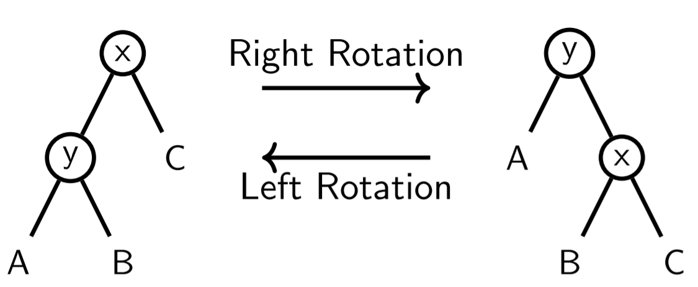
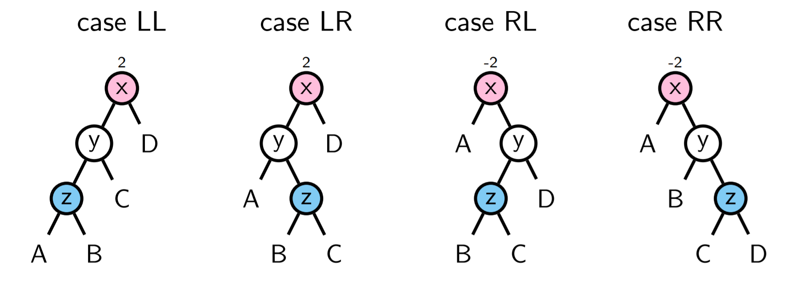
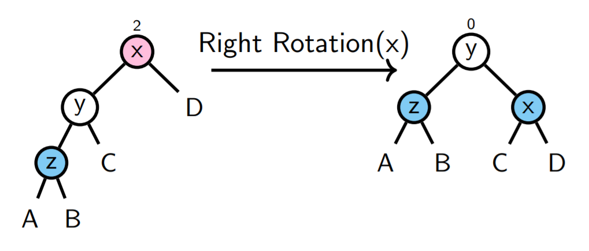
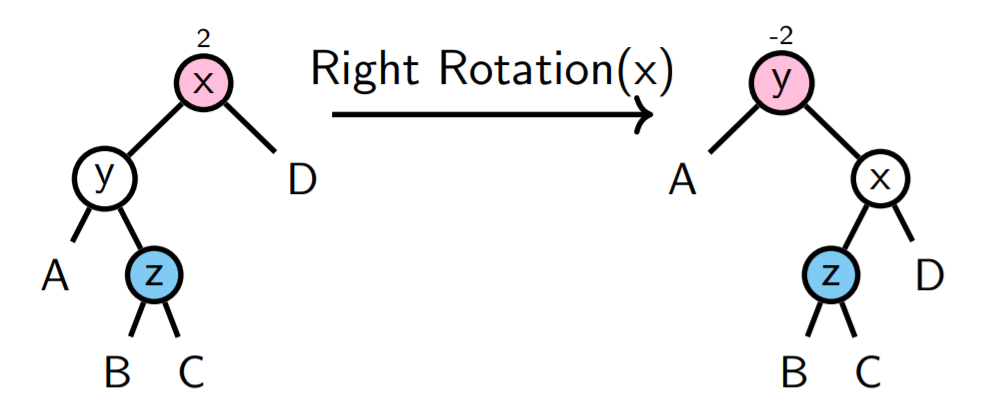
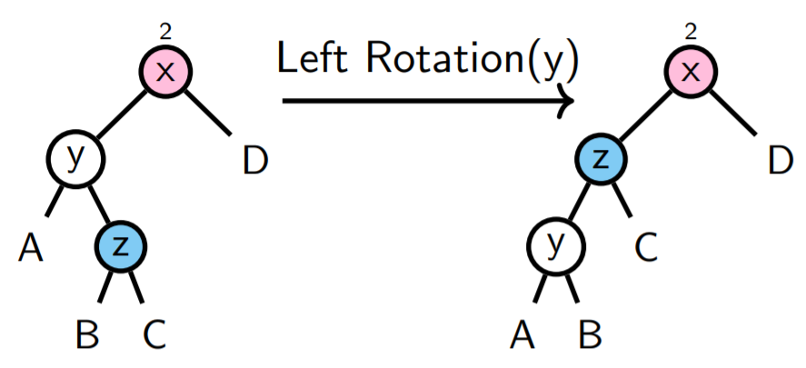
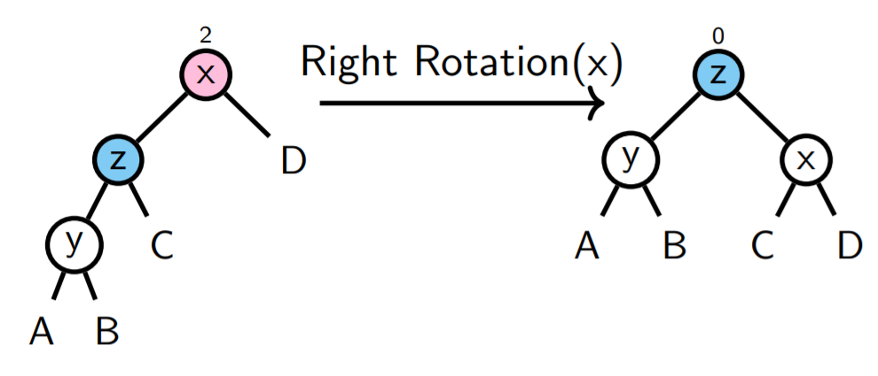
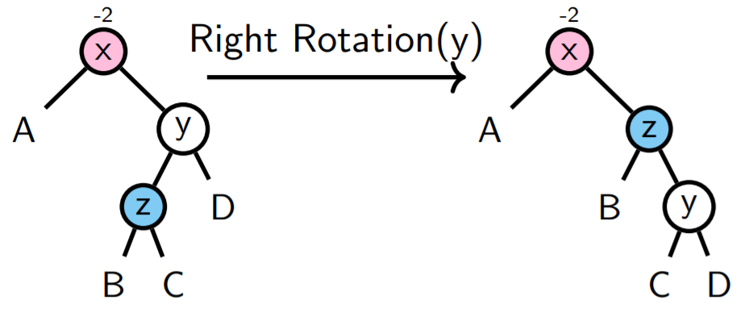
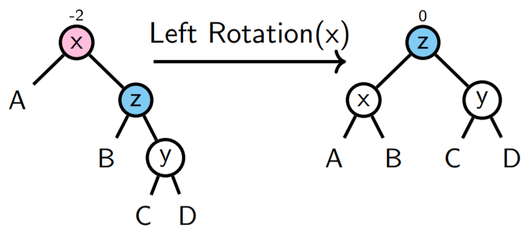

# AVL Tree/AVL树

<center>
<span>16/10/2021</span>
<a style="text-decoration:none; color: black;" href="https://github.com/KevinZonda">KevinZonda</a>
</center>

AVL 树是一种自平衡的 BST。对比基础 BST，其优势在于搜索最差情况下的优化，但是代价是插入性能的下降。

思考如下情况

```
1
 \
  2
   \
    3
     \
      4
       \
        5
```

对于搜索即存在最差情况。

## 基础

**节点的 Height:** 是该节点到叶子节点最长路径的长度

**节点的 balance:** 计算公式为

$$
\text{Balance} = \text{Heigh}_\text{Left Subtree} - \text{Heigh}_\text{Right Subtree}
$$

需要注意

- 空树的Height为-1
- 叶子节点的balance 是 $(-1)-(-1)=0$

**AVL 树：** 一个BST，并且每个节点的 balance 为 -1, 0, 1

## Perfect Binary Tree/完美二叉树

Perfectly balanced: 完美平衡的，指每个节点的 balance 均为 0。

=  Maximal AVL tree of a given height

```
           x       ---------- 1 node  (2^0)
      /         \
     x           x    ------- 2 nodes (2^1)
   /   \       /   \
  x     x     x     x   ----- 4 nodes (2^2)
 / \   / \   / \   / \
x   x x   x x   x x   x   --- 8 nodes (2^3)
```

因此我们可以得出一个高度为 $h$ 的树，其节点数为
$$
N_{\text{node}}=1+2+4+8+\cdots+2^h=2^{h+1}-1
$$

## Fibonacci Trees/斐波那契树

= Minimal AVL trees of a given height

- Height = 1，有两种可能性

```
x          x
 \   or   /
  x      x
```
size = 2

- Height = 2:

```
  x           x            x          x
 / \         / \          / \        / \
x   x   or  x   x  or    x   x  or  x   x
     \         /        /            \
      x       x        x              x

```
size = 4

总的来说我们可以总结为：

斐波那契额的高度可以被计量为

$$
\text{size of }T_{h+2}= 1 +\text{size of }T_{h+1}+\text{size of }T_{h}
$$

- $T_1$ 为空树
- $T_0$ 为一个元素的树

为此我们可以获得：

- $T_{-1}=0$
- $T_0=1$
- $T_1=2=1+T_0+T_{-1}=1+1+0$
- $T_2=4=1+T_1+T_0=1+1+2$
- $T_3=7=1+T_2+T_1=1+4+2$
- $\cdots$
- $T_{h+2}=1+T_{h+1}+T_h$

Compare to `fib(x)`: $T_h+1=F_{h+3}$

通过上过程，我们可以发现

$$
|\text{Fib Tree}| \leq
|\text{AVL}| \leq
|\text{ Perfectly Balanced Tree}|
$$

因此

$$
\text{Fib}_{h+3}-1\leq
|\text{AVL}_h| \leq
2^{h+1}-1
$$

By Binet's formula:

$$
F_k=\cfrac{
    \Big(
        \cfrac{
            \sqrt{5}+1
        } {
            2
        }
    \Big)^k
    -
    \Big(
        \cfrac{
            \sqrt{5}-1
        } {
            2
        }
    \Big)^k
}
{\sqrt{5}} \approx O(1.61^k)
$$

size of $n$ has height $O(\log n)$

### Generalise

对于 AVL 树，我们可知其size $n$：

$$
\text{Fib}_{h+3}-1\leq
n\leq
2^{h+1}-1
$$
我们拿 $n\leq 2^{h+1}-1$为例：

$$
n \leq 2^{h+1}-1\\
\text{对两边进行对数运算}\\
\log_2 n \leq
\log_2{(2^{h+1}-1)} \leq
\log_2{(2^{h+1})} =
2^{h+1}\\
\text{对式进行整理}\\
h \geq \log_2 n - 1
$$

## Time Complexities/时间复杂度

- `search(x)`: $O(\log n)$
- `insert(x)`:
  1. 找到需要插入的位置 $O(n)$
  2. 插入 $O(1)$
  3. 重新平衡
     1. 需要进行 $O(\log n)$ 次$O(1)$ 操作
  4. 总时间是 $O(\log n)$
- `delete(x)`: 类似于插入，需要 $O(\log n)次$

## Re-balancing/重平衡



对于 AVL 树，平衡只是用旋转（rotation），其中包含左旋与右旋。

```go
func rightRotate (x *node) *node {
    y := x.left
    b := y.right
    x.left = b
    y.right = x
    return y
}

func leftRotate (y *node) *node {
    x := y.right
    b := x.left
    x.left = y
    y.right = b
    return x
}
```

## Insertion/插入

对于插入，我们可能遇见四种需要旋转情况：



- **LL:** 插入在左子树的左子叶
- **LR:** 插入在左子树的右子叶
- **RR:** 插入在右子树的右子叶
- **RL:** 插入在右子树的左子叶

### LL



### RR

与 LL 类似：


### LR

对于此场景，对 x 进行右旋并不能降低 balance，只是会变成 RL。



正确的解决方案是




### RL

与 LR 类似




## Deletion/删除

对于删除，使用 BST 的删除后执行一次 Re-balance 即可。

## Read More

- [AVL Tree - programiz.com](https://www.programiz.com/dsa/avl-tree)
- [Data Structure and Algorithms - AVL Trees - tutorialspoint.com](https://www.tutorialspoint.com/data_structures_algorithms/avl_tree_algorithm.htm)
- [AVL Tree Visualization](https://www.cs.usfca.edu/~galles/visualization/AVLtree.html)