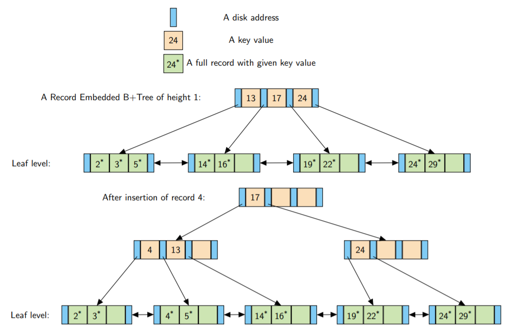
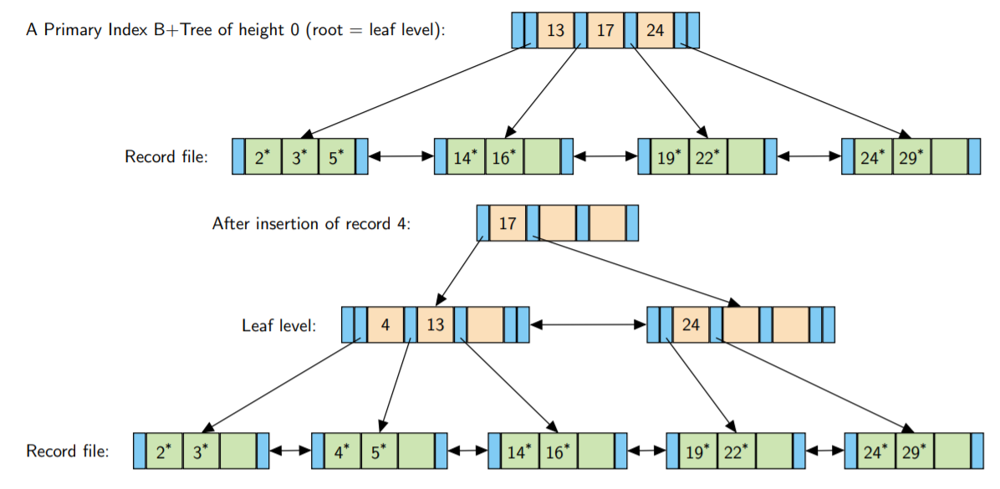

# B-Trees & B+Trees/B 树与 B+ 树

<center>
<span>17/11/2021</span>
<a style="text-decoration:none; color: black;" href="https://github.com/KevinZonda">KevinZonda</a>
</center>

## B-Tree

m 阶B树是一个 n 元树（n-ary tree）
- 每一个节点有最多 m 个孩子
- 每非叶子节点，除了根节点，最少有 m/2 个孩子
- 根节点，如果非叶子节点，最少有 2 个孩子
- 有 c 个孩子的非叶子节点，包含 c-1 个搜索关键词（key value），关键词扮演分割器或鉴别器（discriminators）去引导搜索正确的子树
- 所有叶节点出现在相同等级
- B 树总是 height balanced
- 更新和搜索的复杂度均为 $O(\log n)$

不同作者的定义的 B 树有不同方式，但是没有人使用基础 B-树
当是内存存储结构中，相比于AVL树与其他 height balanced二叉树，例如2-3树或红黑树，或其他更难以实现的树相比，没有显著的优势。

总而言之，B 树不太行，所以就有了 B+ 树，其主要用于数据库和*外部*数据结构（external data structure）。

## External Data Structures/外部数据结构

外部数据结构是存储于外存（external memory）或二级内存（secondary memory）而不是内部存储（RAM），这意味着
- 可以超越程序运行，让结构可以在磁盘中存取
- 可以支持巨大的体积
- 可以被多个程序访问

对于磁盘存储，通常来说存储被区分为大小相同的块（block），通常为 4K Bytes，最高可达 64 KBytes。

此盘只能每次传输一整个块。所以写入通常是
- 读取一个块
- 在内存修改
- 写入

在机械硬盘重寻找磁轨需要更多时间。

## B+ Tree/B+ 树

### Basic

在 B+ 树中，有以下核心点：
- Data Record/数据记录：信息元素
- Key Value/关键词：用来区分记录的值
- Discriminator/鉴别器：决定在搜索记录时沿着树的哪条路径的值。几乎总是某个记录的关键词，但原则上，它不一定是这样
- Disk Address/磁盘地址：数据在磁盘的位置

B+ 树的节点被设计成适合于磁盘块，因此，读或写一个节点相当于读或写一个磁盘块（或一连串的磁盘块）。

大多数关于 B+ 树的描述都是以 B+ 树的*阶数（order）* 为起点，其定义最小或最大的 child 数，或者树的非根部内部节点中最小或最大的关键词数（对于同一棵树，这可能是4个不同的数字！）

然而，在现实世界的 B+ 树实现中，首先，键值往往是可变长度的字符串，其次，每个节点中子节点数的限制因素不是一些任意的顺序规范，而是由在一个磁盘块可以容纳多少键和磁盘地址决定。

由于键的长度可以是可变的，所以树的一个内部节点的最大 child 数不是固定的。

### B+ 树的种类

通常来说，B+ 树被分为两种：
- Record-Embedded B+Trees/记录嵌入式 B+ 树：其存储数据记录在叶子节点。通常适用于
  - 唯一关键词数据
  - 全托管数据记录（一个数据被一个关键词完整记录，删除这个B+ 树相当于删除了整个记录）
- Index B+ Trees/索引 B+ 树：只存储关键词和在叶子节点存储地址。通常用于：
  - 数据与 B+ 树分离，所以删除 B+ 树不影响数据
  - 可以创建多个索引

### Record-Embedded B+Trees/记录嵌入式B+ 树



#### 搜索

类似于 BST，从根节点开始，通过数据鉴别器细分，例如

```
// [] 为鉴别器
|[1]|[5]|[6]|
↑   ↑   ↑   ↑
a   b   c   d

a (-∞, 1)
b [1, 5)
c [5, 6)
d [6, ∞)
```
搜索到的最后是叶子节点是数组，通过遍历或二分法等进行搜索。

#### 插入

- 通过类似 BST 的方法搜索到需要插入的地方，如果空间足够，则插入
- 否则分裂块成为2个
- 将分裂出的左侧的最右侧的节点当作鉴别器传递指上层节点  
  ```go
  // m = 5
  [0, 1, 2, 3]
  // 插入 4
  [0, 1, 2, 3, 4] // len = 5, 分裂（不属于[m/2, 5)）
  // 分裂
  [0, 1, 2]  [3, 4]
  [0, 1] [2] [3, 4]
  // Post
        [2]
      /     \
  [0, 1]   [3, 4]

  // m = 4
  [0, 1, 2]
  // 插入 3
  [0, 1, 2, 3] // len = 4, 分裂（不属于[m/2, 4)）
  // 分裂
  [0, 1]  [2, 3]
  [0] [1] [2, 3]
  // Post
      [1]
     /   \
  [0]   [2, 3]
  ```
- 如果上方存在足够空间则插入并结束
- 如果没有，则继续分裂，直到完成整个国程

一些性质

- 树height仅在根节点分裂时才会增加，也因此根节点到叶子路径长度永远相同
- 没有节点小于半满，除了根节点
- 删除的工作方式与插入相反：每当从一个叶子节点中删除一条记录时，如果该节点变得不足一半，那么它和它的邻接节点的记录就会在它们之间分配。如果这两个节点的记录都不足一半，那么这两个节点就会被合并，并从上一级删除一个条目。这可以在树上层层递增，直到根节点的两个子节点被合并并成为新的根，树的高度减少1。

#### Bulk Loading/大量装载

当我们创建了新的 B+ 树并需要装载大量数据时，我们往往需要大量时间去迭代寻找需要插入的位置（因为每一次搜索都需要进行 $O(\log n)$，需要进行 $n$ 次，所以需要执行  $O(n\log n)$）。

Bulk Loading 会更加高效。

- 对数据进行排序，然后插入叶子节点的记录List中
- 构建叶子区块时，插入判别器等来构建父节点
- 当父节点满后分裂

用人话说就是从下而上构建 B+ 树，而不是从上而下。

缺点是所有拆分都是右侧路径，而不是随机的。所以不适合内存中很大的树。

### Index B+ Trees/索引 B+ 树

通常来说 索引 B+ 树分为两中，取决于数据排序方法不同：

- **二级索引 B+ 树：** 记录并不是必须存储在文件块种。因此每一个叶子节点的每个实体包含一对由关键词和磁盘地址组成的对，该地址确定了可以找到具有该键值的记录的磁盘块。叶子节点也有正向和反向的指针。
- **主键索引 B+ 树：** 记录块的数据使用 B+ 树种的关键词排序。因此 B+ 树的叶节点只需要存储鉴别器以分割数据块。这与记录嵌入式 B+ 树非常类似。叶子节点也有正向和反向的指针。

一个记录文件上只能有一个主键索引，因为这些记录只能有一个顺序，但同一文件上可以有多个二级索引。

#### Primary Index B+ Tree/主键索引 B+ 树



#### Secondary Index B+ Tree/二级索引 B+ 树


### Complexity/复杂度

因为是 height balanced，使用搜索需要 $O(\log n)$。

In practice, search will take logmn reads of pages where the fanout ratio
of the tree is m (The fanout ratio is the number of children in each
node). With a 4KByte block, a 4 byte integer key, a 4 byte disk address
size, with every block being half full, and even assuming a little space is
in each block is taken with extra administrative information, that gives a

fanout ratio of at least 250.
- Tree of height 1: 250 records
- Tree of height 2: 62,500 records
- Tree of height 3: 15,625,000 records
- Tree of height 4: 3,906,250,000 records