# Priority Queue, Binary Heap Trees & Binomial Heaps/优先队列，二叉堆树与二项堆

<center>
<span>03/01/2022</span>
<a style="text-decoration:none; color: black;" href="https://github.com/KevinZonda">KevinZonda</a>
</center>

## Priority Queue/优先队列

Key Value 决定了优先级。

本节以优先级高先出。

### Implements

- **Unsorted Array**  
  Insert: O(1)  
  Get: O(n)
- **Sorted Array**  
  Insert: O(n)  
  Get: O(1)
- **AVL Tree**  
  Insert: O(log n)  
  Get: O(log n)

#### 完全二叉树/Complete Binary Tree

其使用了一个种名叫 Binary Heap Tree（二叉堆树）的 CBT （完全二叉树）。

**定义：** 完全二叉树从根结点到倒数第二层满足完美二叉树，最后一层可以不完全填充，其叶子结点都靠左对齐。

> **Definition:** A Complete Binary Tree (CBT) is a binary tree in which every level, except possibly the last, is completely filled, and all nodes are as far left as possible.

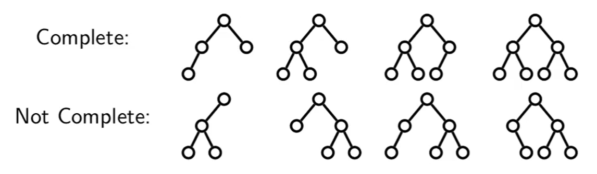

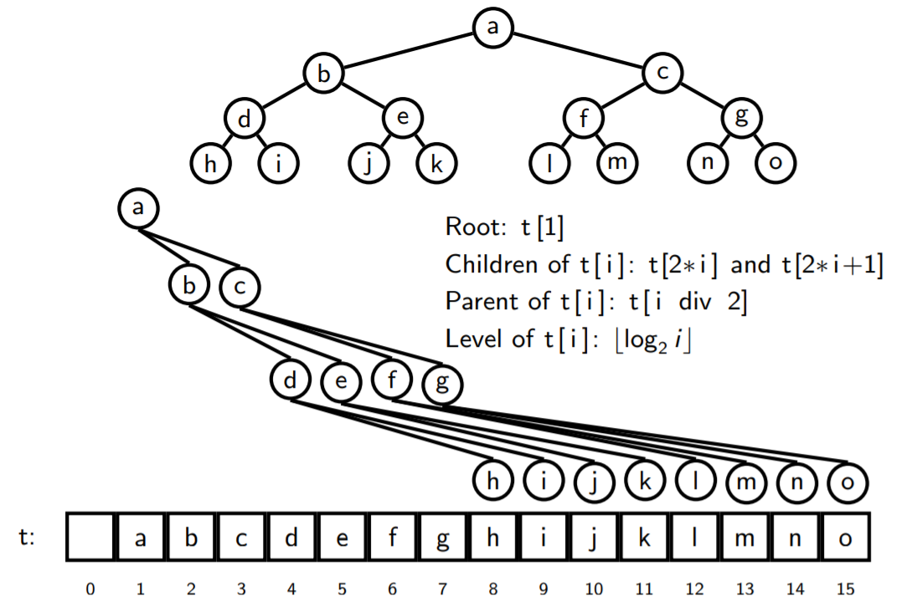

从此图可以看出根节点为 Index = 1，即，我们忽略 0 位。

对于其孩子，则为 t[2 * i] 和 t[2 * i + 1]。

其父母为 t[i / 2]。

其层级为 ⌊log2(i)⌋。

如果二叉树不完全，则：

- 这是一个浪费的实现：空间依旧为缺失节点保留。
- 当节点确实，数组原需要需要被标记以表示其不是树的一部分。
  - 使用非法值
    E.g. -1，null，etc.
  
  - 使用拆分数据结构 （例如 bit array）去表示是否包含一个真实值。  
  ```
  Tree: [1, 1, 1]
  Bit : [1, 1, 0]
               ^ Represent is not a real value
  ```

如果二叉树总是完整，则：
- 一个整形去记录树的最后一个节点是充足的
- 你不需要记录缺失的节点，因为在树结束之后没有其他节点。

## Binary Heap Tree/二叉堆树

**定义：** 二叉堆树是一种完全二叉树，其是空的或者满足以下条件
- 根的优先级大于或等于它的子的优先级。
- 根的左右子树均为堆树。

**注意：** 不像 BST，BHT没有对左子和右子数值上的要求。因此我们不需要保持 BHT 是顺序的。

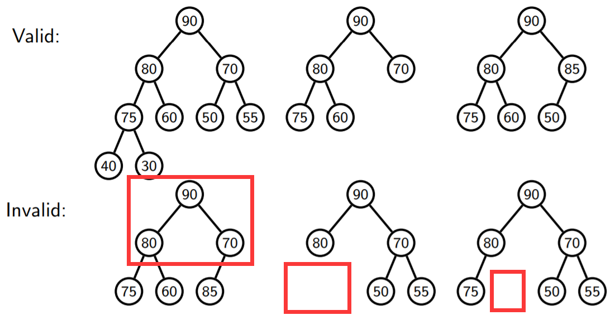

```csharp
public class PriorityHeap {
    private const int MAX = 100;
    private int[] heap = new int[MAX + 1];
    private int n = 0;

    public int Value(int i) {
        if (i < 1 || i > n) 
            throw new IndexOutOfRangeException();
        return heap[i];
    }

    public bool IsRoot(int i)
        => i == 1;

    public int Level(int i)
        => (int)Math.Floor(Math.Log(i, 2));

    public int Parent(int i)
        => i / 2;

    public int Left(int i)
        => 2 * i;

    public int Right(int i)
        => 2 * i + 1;

    public bool IsEmpty()
        => n == 0;
    
    public int Root()
    {
        if (IsEmpty())
            throw new InvalidOperationException("Empty Heap!");
        return heap[1];
    }

    public int LastLeaf()
    {
        if (IsEmpty())
            throw new InvalidOperationException("Empty Heap!");
        return heap[n];
    }
}
```

### Insertion

**思路：**插入值道最后一层，然后冒泡其直到其大于其父节点。

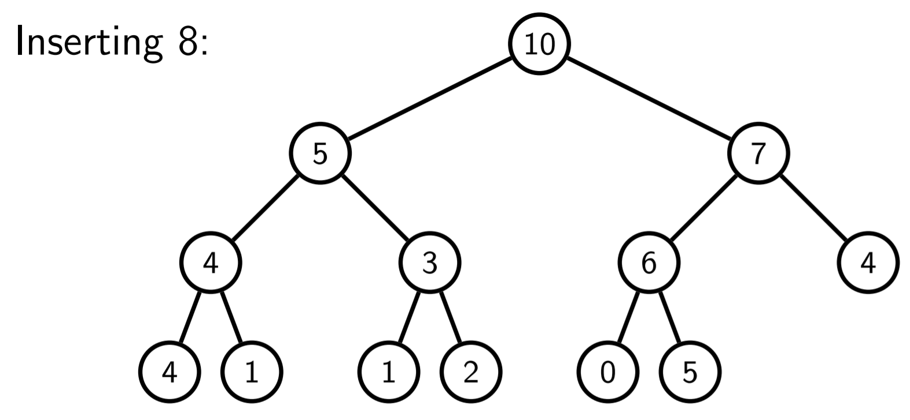
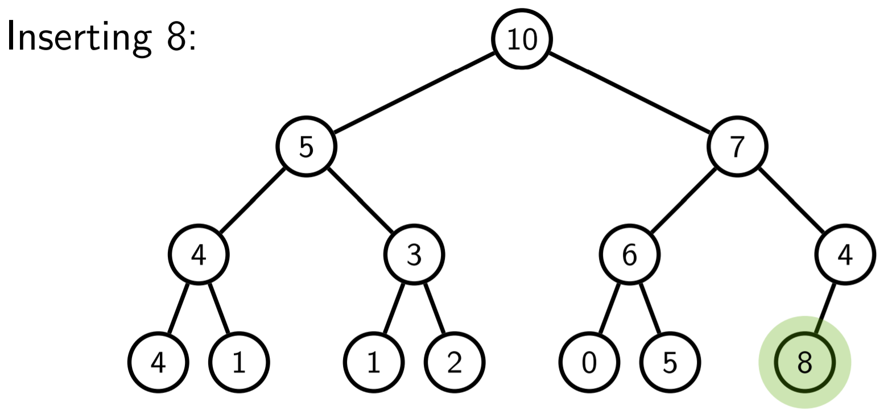
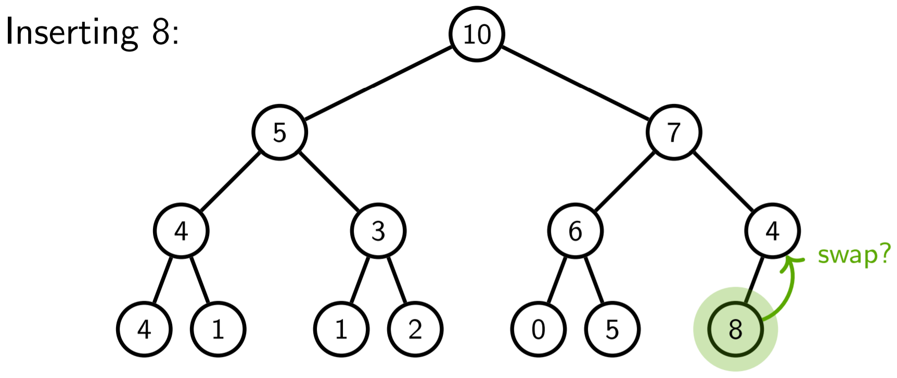
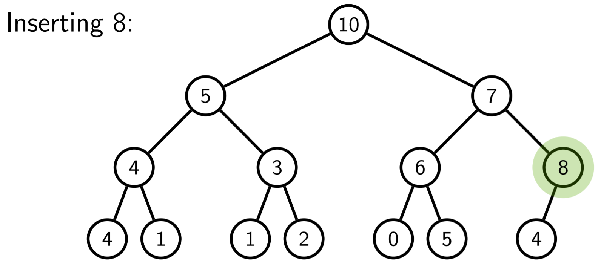
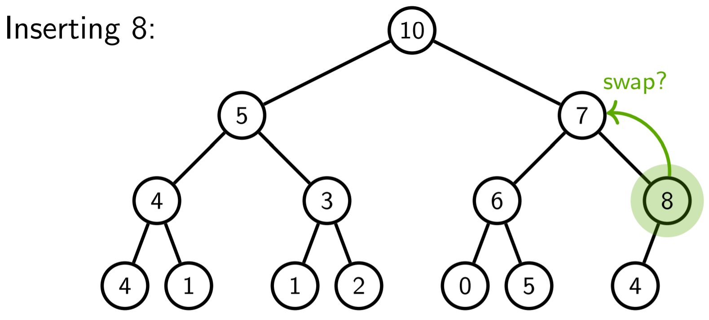
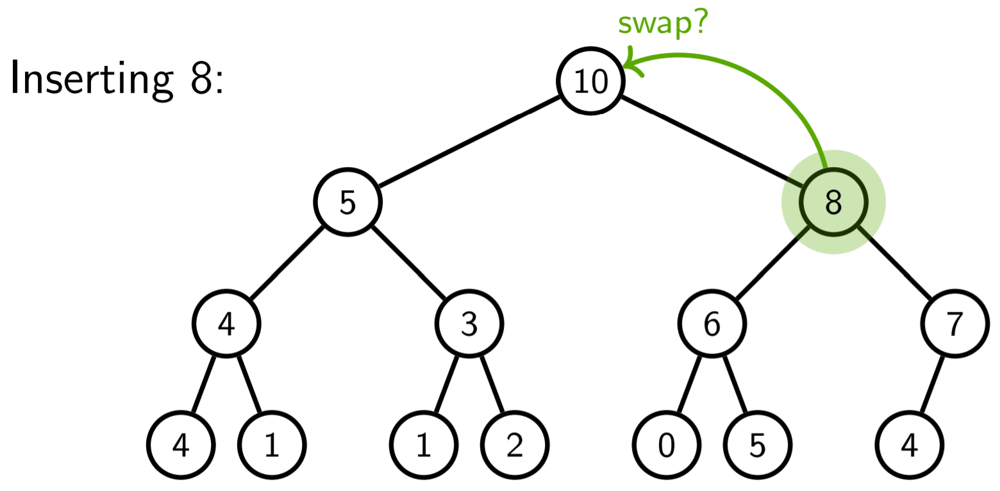
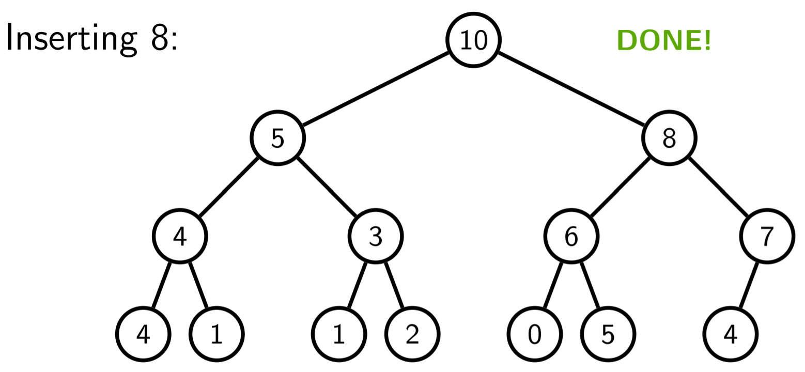

```csharp
// All code should be put into PriorityHeap class

public void Insert(int p)
{
    if (n == MAX)
        throw new InvalidOperationException("Heap is Full");
    ++ n;
    heap[n] = p;
    BubbleUp(n);
}

private void BubbleUp(int i) {
    // Root!
    if (i == 1)
        return;
    
    if (heap[i] > heap[Parent(i)])
    {
        // Swap(heap[i] heap[Parent(i)]);
        int temp = heap[i];
        heap[i] = heap[Parent(i)];
        heap[Parent(i)] = temp;

        BubbleUp(Parent(i));
    }
}
```


### Deletion

#### Delete Root

**思路：**
1. 移除最后一个节点并用其替换根节点
2. 然后向下冒泡，直到其比孩子拥有更高优先级

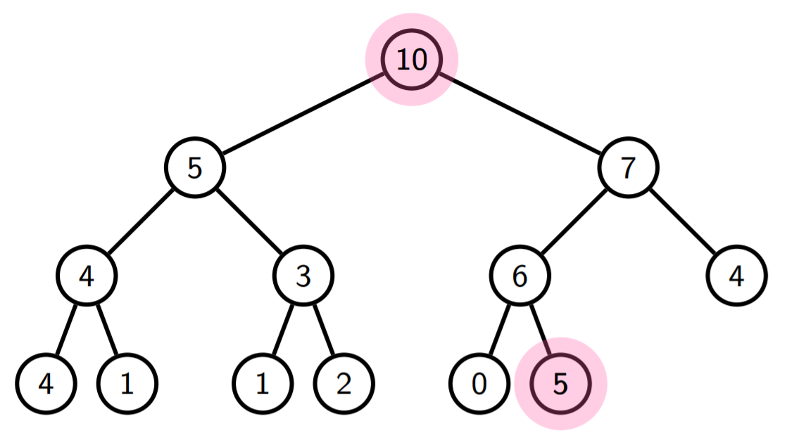
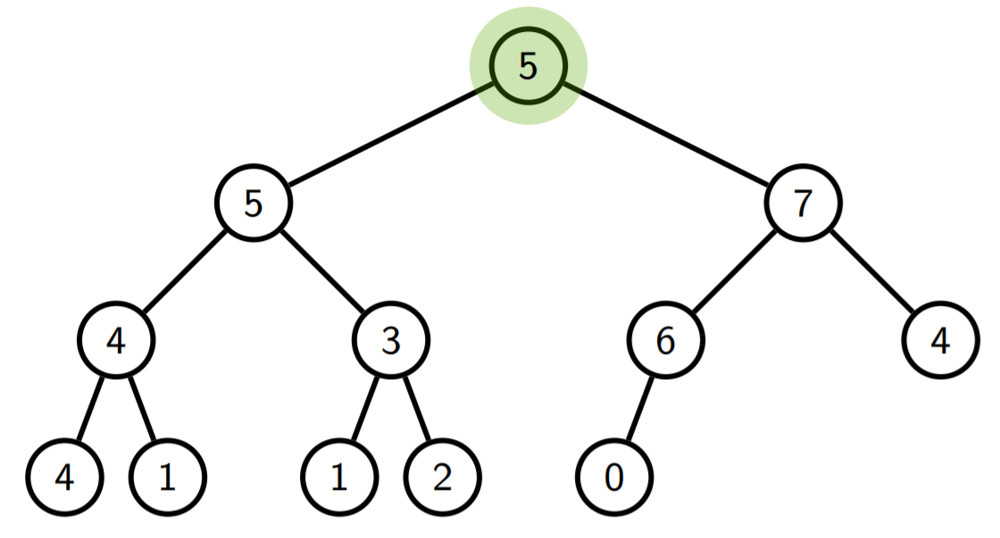
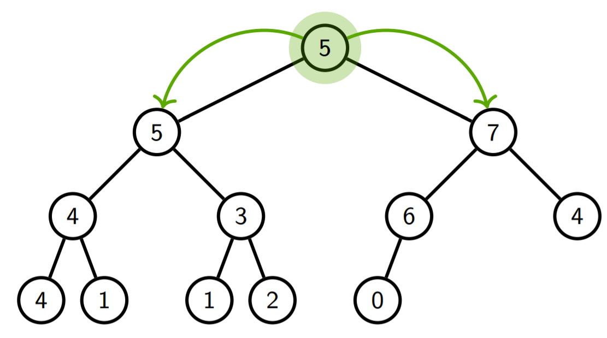
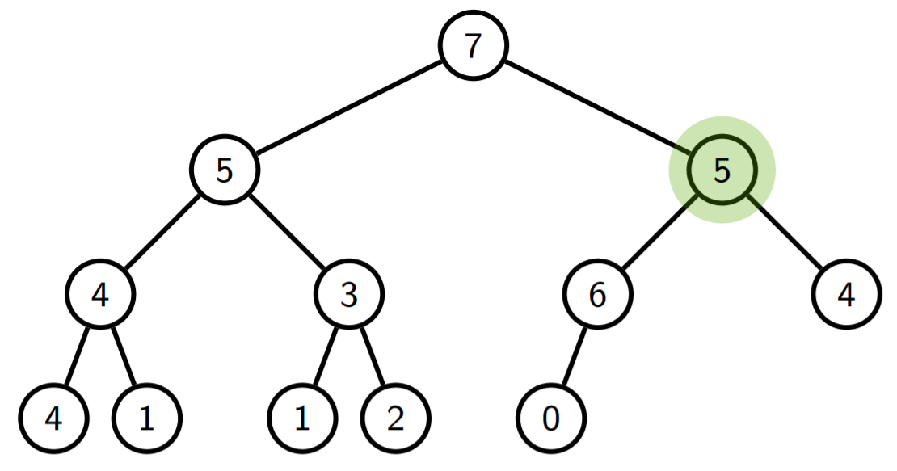
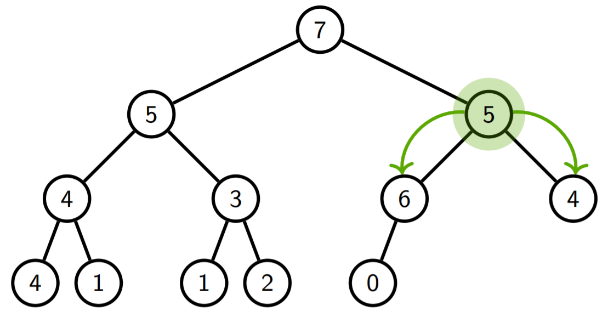
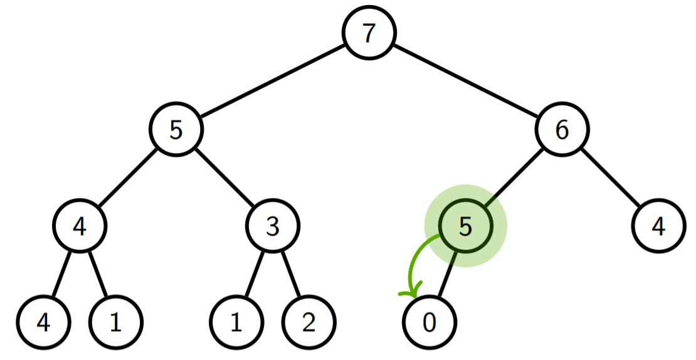
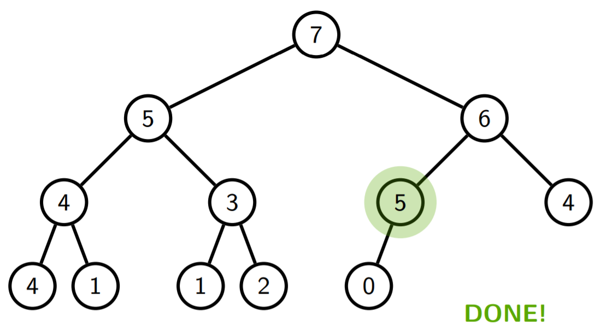

```csharp
// All code should be put into PriorityHeap class
public void DeleteRoot()
{
    if (IsEmpty()) // or n < 1
        throw new InvalidOperationException("Empty Heap!");

    heap[1] = heap[n];
    -- n;
    BubbleDown(1);
}

```

对于 `BubbleDown` 方法，我们需要处理 5 种情况：
1. 如果是叶子节点
   不需要做什么，`BubbleDown` 已经完成
2. 如果只有左节点，没有右节点  
   与左节点进行交换，然后就完成了（没有右节点意味着左子不可能有其余节点）
3. 有两个子节点，左子节点的优先级更高，并比当前节点还高  
   当前节点与左节点交换并且递归的交换左子节点
4. 和上一个情况相似，只不过是右节点更大：  
   如上一个情况一样，但是交换的为右节点
5. 有两个子节点，都不大于当前节点  
   什么都不做，冒泡已经结束

```csharp
// 需要注意，这里其实 heap 和 n 已经在上文定义
private void BubbleDown(int i, int[] heap, int n) {
    if (Left(i) > n)                // No Child
        return;
    else if (Right(i) > n)          // Only Left Child
    {
        if (heap[i] < heap[Left(i)])
        {
            // Swap(heap[i] heap[Left(i)]);
            int temp = heap[i];
            heap[i] = heap[Left(i)];
            heap[Left(i)] = temp;
        }
        return;
    }
    else                           // Two Children
    {
        if (heap[Left(i)] > heap[Right(i)] &&
            heap[i] < heap[Left(i)])
        {
            // Swap(heap[i] heap[Left(i)]);
            int temp = heap[i];
            heap[i] = heap[Left(i)];
            heap[Left(i)] = temp;

            BubbleDown(Left(i), heap, n);
        }
        else if (heap[i] < heap[Right(i)])
        {
            // Swap(heap[i] heap[Right(i)]);
            int temp = heap[i];
            heap[i] = heap[Right(i)];
            heap[Right(i)] = temp;

            BubbleDown(Right(i), heap, n);
        }
    }
}
```


#### Delete

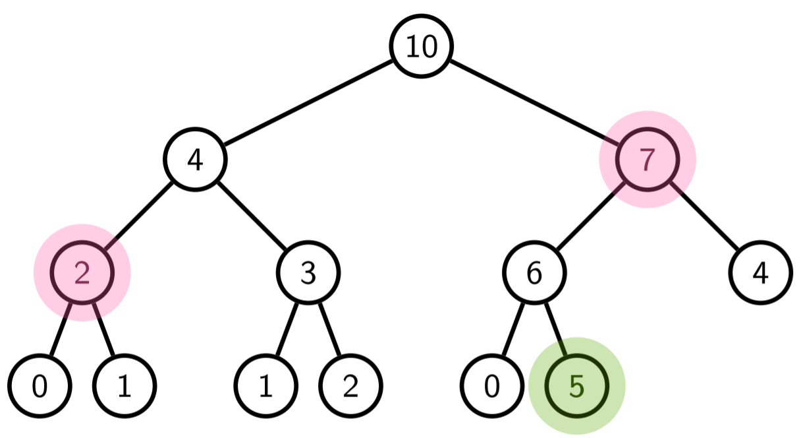

删除一个任意节点意味着节点可以在树的任意部分。

1. 删除最后一个节点以替换需要被删除的节点。
2. 这个节点可能小于其子节点也可能大于其父节点，使用 `BubbleDown` 和 `BubbleUp` 都有必要

```csharp
public void Delete(int p)
{
    if (IsEmpty()) // or n < 1
        throw new InvalidOperationException("Empty Heap!");

    if (p < 1 || p > n)
        throw new IndexOutOfRangeException();

    heap[p] = heap[n];
    -- n;

    BubbleUp(p);
    BubbleDown(p);
}
```

### Update

更新意味着修改一个节点的优先级。其工作方式类似于 Delete

```csharp
public void Update(int i, int priority)
{
    if (IsEmpty()) // or n < 1
        throw new InvalidOperationException("Empty Heap!");

    if (i < 1 || i > n)
        throw new IndexOutOfRangeException();

    heap[i] = priority;
    BubbleUp(i);
    BubbleDown(i);
}
```

### Heapify & Merge

#### Heapify

插入一个 n 个项目的集合进入一个空 BHT 需要进行 $n$ 次复杂度为 O(Log n) 的插入操作，因此总复杂度为 O(n log n)。

但是有一个更有效的方法：如果我们将这些项以随机顺序放入一个数组 （起始索引为 1）。然后我们在里面已经有了 CBT，但是还不是 BHT。目前为止，所有叶子节点均满足了堆树的要求，而堆树内部节点还没有。

我们因此可以对内部节点从最后一个内部节点进行迭代，并一次向前调用 `BubbleDown` 直到最开始。每一次执行，我们保证基于那个节点的子树成为一个合法的 BHT，因此在最后整个树将会成为一个合法的 BHT。

> DeepL:  
> 有一个更有效的方法。如果我们在数组中以随机顺序排列项目（从索引位置1开始），那么我们已经有了完整二叉树的形式，但没有二叉堆树的形式。在这一点上，所有的叶子节点都满足堆树属性，但内部节点不满足。
> 
> 因此，我们可以在内部节点上进行迭代，从最后一个内部节点开始，一直到第一个内部节点，依次对每个内部节点调用 `bubbleDown`。每一次，我们都确保基于该节点的子树成为一个有效的二元堆树，所以最后，整个树是一个有效的二元堆树。

最后一个节点为 n，其父母为 n / 2，并且其必然为最后一个树上内部节点。

因为 n / 2 + 1 需要拥有左子节点 2 * (n / 2 + 1) = n + 2，其并不存在，所以节点 n / 2 + 1 必然不是一个内部节点。

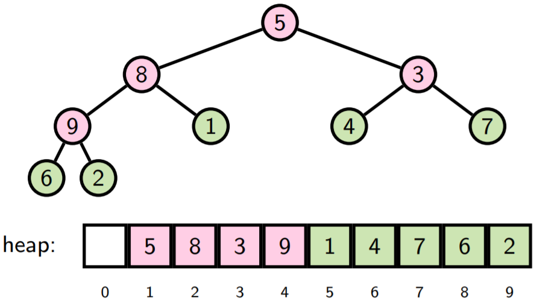

```csharp
public void Heapify()
{
    for (int i = n / 2; i > 0; -- i)
        BubbleDown(i);
}
```

一个高度为 h 的堆树，其根节点需要交换 h-多（h-many）个节点，1层的节点需要交换 (h-1)-多（h-1-many） 的节点，因此**最差情况** ，总计交换为：

$$
\begin{aligned}
C(h)&=2^0(h-0)+2^1(h-1)+2^2(h-2)+\dots+2^{h-1}(h-(h-1))\\
&=\sum^{h}_{i=0}{2^i(h-1)}=\cfrac{2^h}{2^h}\sum^{h}_{i=0}{2^i(h-1)}=2^h\sum^{h}_{i=0}{\cfrac{h-i}{2^{h-i}}}\\
&=2^h\sum^{h}_{j=0}{\cfrac{j}{2^j}}\leq 2^h\sum^{\infty}_{j=0}{\cfrac{j}{2^j}}\\
\end{aligned}
$$

因为 $\sum^{\infty}_{j=0}{\cfrac{j}{2^j}}=2$，我们可以认为 $C(h)=2^h\times 2 = 2^{h+1}$.

因此 heapify 的复杂度为 $O(2^{h+1})=O(2^h)=O(n)$

#### Merge

合并两个大小近似为 $n$ 的 BHT 的三种主要方法：

- 将一棵树上的每个项目插入另一棵树上  
  需要执行 $n$ 次插入，因此为 O(n log n)
- 删除较大树的最后一个元素并将其插入较小树中，直到由虚根节点（dummy root node）和小树和大树分别作为其左右子节点组成。然后使用标准的删除方法来删除假根节点  
  平均来说，一棵树大约一半的叶子节点需要被插入到另一个树，因此需要执行 O(n) 次插入，因此复杂度为 O(n log n)。但是操作数只有上一个方法的 1/4，因此会更快。
- 串联数组形式并调用 heapify  
  O(n)


## Binomial & Fibonacci Heaps/二项堆与斐波那契堆

**定义：** 二项树被以下递归定义：  
- 0 阶二项树是一个单独的节点
- 一个 $k$ 阶的二项树有一个根节点，其子节点为阶数为 k-1, k-2, ..., 2, 1, 0 的二项树。

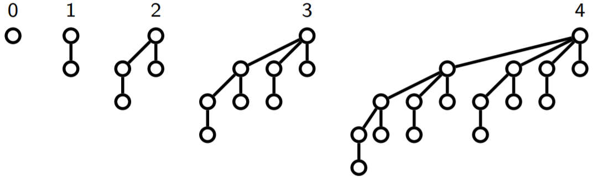

**注意：** 

- $k$ 阶二项树有明确的 $2^k$ 个节点
- 一个 $k$ 阶二项树可以由 2 个 $k-1$ 阶二项树构造而来。  
  方法是将其中一个二项树作为另一个二项树根部的最左边的新孩子：这是二项堆的有效 `Merge` 操作的基础。

一个二项堆是一个具有如下性质的二项树的表列（list）：
- 每一阶的二项树只能有 0 个或 1 个。
- 每个二项树都满足优先级排序：每个节点的优先级都小于或等于其父节点

最典型的实现是双链表（doubly linked list）。


**样例：** Find Max

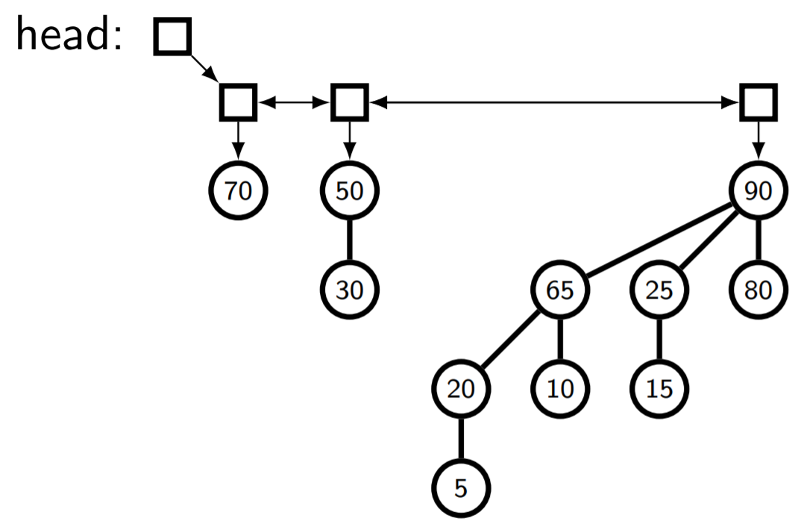

需要注意，在不同的二项树组成部分中，键之间没有排序。

找到具有最高优先级的节点是通过比较根值的线性搜索（linear search）来实现的。由于在最坏的情况下 在每个连续的树中，节点的数量都是之前的双倍（e.g. 上一个树由2个节点，则这个为4个），所以需要有 log n 棵树以存储n个值，因此复杂度为 O(log n)

### 二项堆合并

在二项树中插入一个新的值，是通过将一个简单的单节点堆与新的值合并到现有的堆中。

注意，如果我们有两个相同阶数 k 的二项树，我们可以将它们合并成一个阶数为 $k+1$ 的二叉树，方法是将其中一个树作为另一个树的根的最左边的孩子。

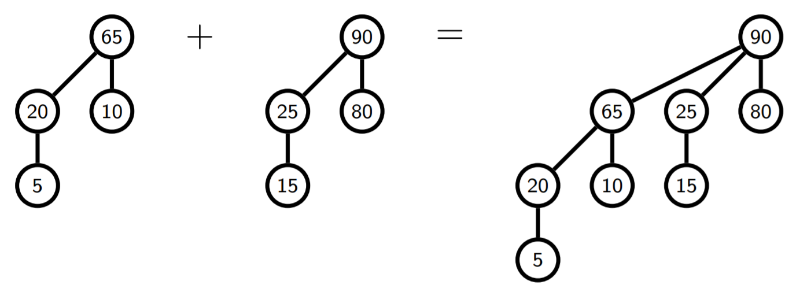

合并类似于加法。

- 相加两个同为 k 阶的树产出一个 $k+1$ 阶的树，被称之为 “进位输出（carry out）”
- 从阶数遍历树。对于每一个阶数，将所产生的树和进位输出设定为设置为任何仅为输入和该顺序的树在两个堆中的合并。
- 对于任何特定阶数 $k$，可能由 0 到 3 个输入树去合并，下列影响会被发生在结果堆：
  - 0：没有 $k$ 阶的输出树，并且没有进位输出
  - 1：$k$ 阶的输出树是输入树，并且没有进位输出
  - 2：没有 $k$ 阶的输出树，并且进位输出（$k+1$阶）是这两个输出树的合并
  - 3：$k$ 阶输出树为输入树的其中一个，并且进位输出（$k+1$阶）为其余两个输入树的合并。

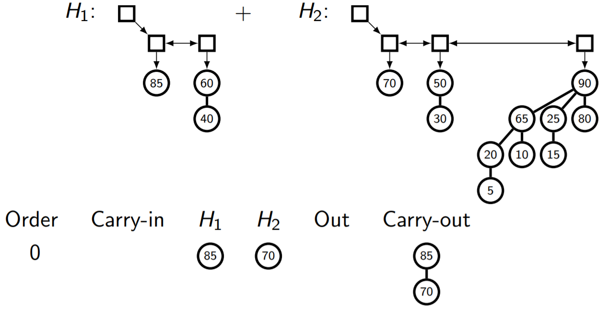
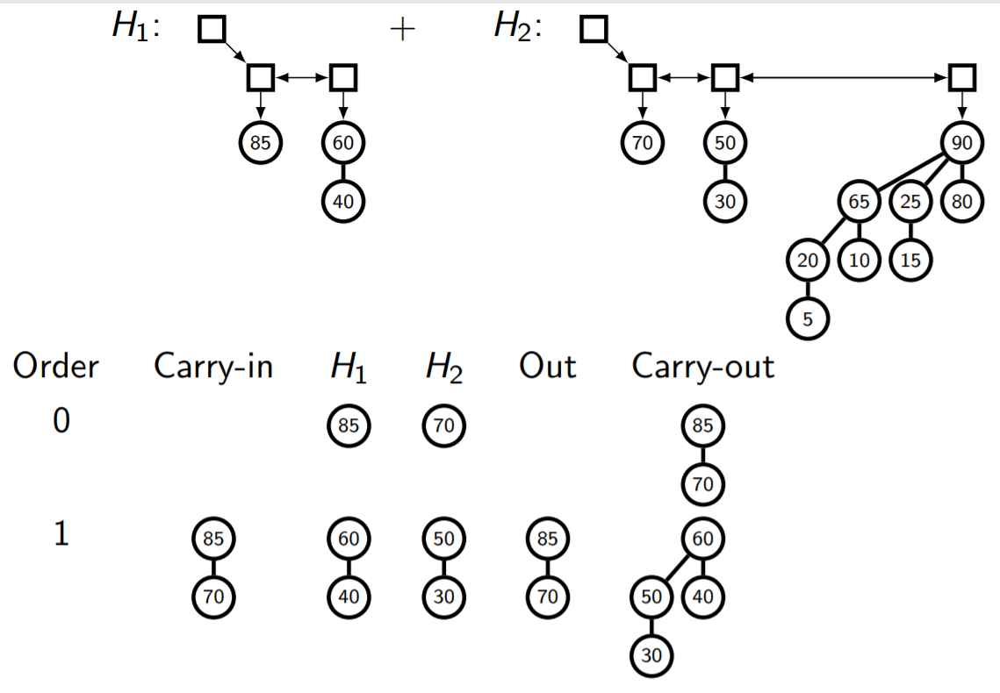
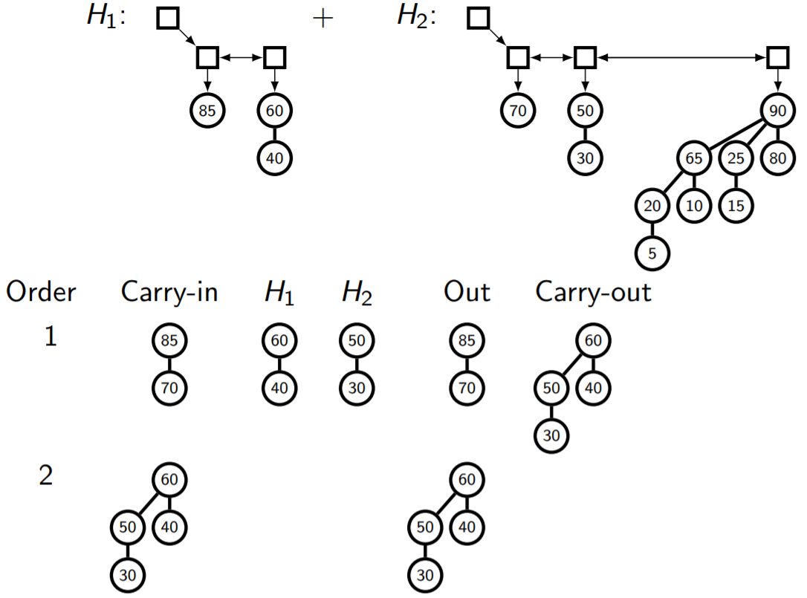
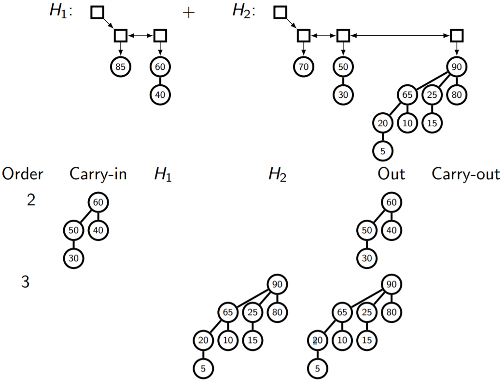


#### 复杂度

合并两个二项树为 O(1)

合并两个二项堆，通常来说，是合并 O(log n) 个二项树，所以为 O(log n)。

插入合并两个二项式堆：一个有一个 0 阶的二项式树。存在以下可能性：
- $\cfrac{1}{2}$：另一个二项堆也有 0 阶二项树，因此需要合并 0 阶树和一个进位输出
- $(\cfrac{1}{2})^2$：另一个堆由一个1阶二项树，并且需要合并
- $(\cfrac{1}{2})^3$ , etc.

平均情况，损耗为：

$$
O(1)\times \sum^{\infty}_{i=1}{(\cfrac{1}{2})^i}=O(1)
$$

### 其余操作

没有快速的方法从 $n$ 个值去创建一个二项堆。所以简单插入 $n$ 次：O(n)

去修改二项堆的一个节点的优先级，我们可以使用类似于二叉堆的 `Bubble up/down`：O(log n)

删除最高优先级的节点需要去找到它：一个线性搜索需要 O(log n)。移除那个树的根节点并且合并其子树回二叉堆需要: O(log n)。总计消耗 O(log n) + O(log n) = O(log n)

删除非根节点可以删除节点的优先级至 $\infty$，让其冒泡至根节点，并和前面的例子一样删除它：O(log n)。

### 斐波那契堆

斐波那契堆与二项堆类似，它们也是一个树的集合，但对其结构有不同的约束。它们比二项式堆要复杂得多，并利用懒惰修改来保持自己的组织性。

与二项式堆相比，它们的优势在于合并的复杂度为 O(1)，而更新一个节点的优先级的均摊（amortised）复杂度为O(1)。

## 复杂度


| 操作    | 二叉堆   | 二项堆   | 斐波那契堆 |
| ------- | -------- | -------- | ---------- |
| 插入    | O(log n) | O(1)*    | O(1)       |
| 删除    | O(log n) | O(log n) | O(log n)*  |
| 更新    | O(log n) | O(log n) | O(1)*      |
| 合并    | O(n)     | O(log n) | O(1)       |
| Heapify | O(n)     | O(n)     | O(n)       |

\* 表示为均摊复杂度