# Sorting Algorithms/排序算法

<center>
<span>05/01/2022</span>
<a style="text-decoration:none; color: black;" href="https://github.com/KevinZonda">KevinZonda</a>
</center>

## Introduction

### Java

- `Comparable`: 是一个接口，拥有方法 `compareTo(obj)`。其返回为 Δ。换句话说，如果 `x.compareTo(y)` 返回 0，则相等，如果是负数，则 `x < y`，反之亦然。
- `Comparator`：定义了 `compare(arg1, arg2)`，其工作类似于 `x.compareTo(y)`，但是类型等可以不同等。

### 基本策略

- **Enumeration/枚举法**  
  对于每个项目，计算比它少的项目数量，比如说 N，然后把当前项目放在 N + 1 的位置。
- **Exchange/交换**  
  如果发现有两个项目的顺序不对，就交换它们。重复进行，直到所有项目都符合顺序。
- **Selection/选择**  
  找到最小的项目，把它放在位置 1，找到最小的剩余项目，把它放在位置 2，...
- **Insertion/插入**  
  每次取一个项目并插入一个最初为空的数据结构中，这样数据结构在每个阶段都会继续被排序。
- **Divide and conquer/分治**  
  递归地将问题分割成更小的子问题，直到你只剩下易于排序的单个项目。然后将排序后的 “部分” 以保留排序的方式重新组合起来。

### Stability in Sorting/排序的稳定性

如果输入的项目具有相同的排序键，稳定的排序算法就不会改变它们的顺序。

当稳定的排序算法应用于已经排序或接近排序的项目列表时，通常会更快。如果你的输入通常是接近排序的，那么你可能会通过使用稳定排序算法获得更高的性能。然而，许多稳定的排序算法比不稳定的排序算法具有更高的复杂性，所以应该仔细检查所涉及的复杂性。


## Bubble Sort (Exchange)/冒泡排序

### 实现

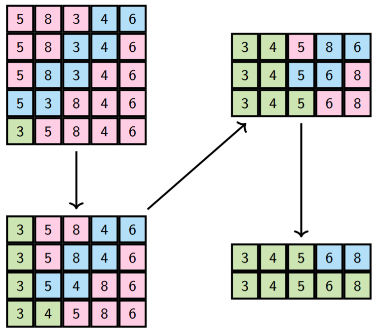

```csharp
public static int[] BubbleSort(int[] arr)
{
    int n = arr.Length;
    for (int i = 1; i < n; ++i)
    {
        for (int j = n - 1; j >= i; --j)
        {
            if (arr[j] < arr[j - 1])
            {
                // Swap(a[j], a[j - 1]);
                int temp = arr[j];
                arr[j] = arr[j - 1];
                arr[j - 1] = temp;
            }
        }
    }
    return arr;
}
```

### 复杂度

外层循环迭代了 $n-1$ 次  
内层循环迭代了 $n-i$ 次  
因此总对比数：

$$
\begin{aligned}
\sum^{n-1}_{i=1}\sum^{n-1}_{j=i}1&=\sum^{n-1}_{i=1}(n-1)\\
&=(n-1)+(n-2)+\cdots+1\\
&=\cfrac{n(n-1)}{2}
\end{aligned}
$$

因此其为 $O(n^2)$。

### 稳定性

由于只有相邻的一对数值可以被交换，而且只有当一个数值严格小于另一个数值时才会进行交换，所以没有一对相同的数值会被交换。因此，冒泡排序不能改变两个具有相同值的元素的相对顺序。因此，冒泡排序是稳定的。


## Insertion Sort (Insertion)/插入排序

### 实现

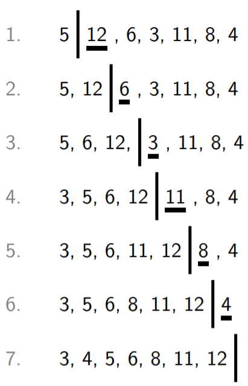

```csharp
public static int[] InsertionSort(int[] arr)
{
    int n = arr.Length;
    for (int i = 1; i < n; ++i)
    {
        int j = i;
        int t = arr[j];
        while (j > 0 && t < arr[j - 1])
        {
            arr[j] = arr[j - 1];
            --j;
        }
        arr[j] = t;
    }
    return arr;
}
```

```
1 > [ 5, 12,  6,  3, 11,  8,  4]
--+-----------------------------
1 | [ 5, 12,  6,  3, 11,  8,  4]
2 + [ 5, 12,  6,  3, 11,  8,  4]
2 | [ 5,  6, 12,  3, 11,  8,  4]
3 + [ 5,  6, 12,  3, 11,  8,  4]
3 + [ 5,  6, 12, 12, 11,  8,  4]
3 + [ 5,  6,  6, 12, 11,  8,  4]
3 | [ 3,  5,  6, 12, 11,  8,  4]
4 + [ 3,  5,  6, 12, 11,  8,  4]
4 | [ 3,  5,  6, 11, 12,  8,  4]
5 + [ 3,  5,  6, 11, 12,  8,  4]
5 + [ 3,  5,  6, 11, 12, 12,  4]
5 | [ 3,  5,  6,  8, 11, 12,  4]
6 + [ 3,  5,  6,  8, 11, 12,  4]
6 + [ 3,  5,  6,  8, 11, 12, 12]
6 + [ 3,  5,  6,  8, 11, 11, 12]
6 + [ 3,  5,  6,  8,  8, 11, 12]
6 + [ 3,  5,  6,  6,  8, 11, 12]
6 | [ 3,  4,  5,  6,  8, 11, 12]
--+-----------------------------
7 < [ 3,  4,  5,  6,  8, 11, 12]
```

操作实例

```
// Following is one step of the
// for loop
+=============================+
| > Input                     |
+-----------------------------+
| [6, 8, 11, 12 | 7, 36, 12]  |
+=============================+
| i = 4                       |
| j =    i = 4                |
| t = a[j] = 7                |
+=============================+
| > Then jump into while      |
+=============================+
| + Loop 0                    |
+-----------------------------+
|   j > 0 && t < a[j-1]       |
| = 4 > 0 && 7 < 12           |
| = True  && True             |
| = True                      |
+-----------------------------+
| a[j] = a[j-1]:              |
| [6, 8, 11, 12 | 12, 36, 12] |
| -- j => 3                   |
+=============================+
| + Loop 1                    |
+-----------------------------+
|    j > 0 && t < a[j-1]      |
|  = 3 > 0 && 7 < 11          |
|  = True  && True            |
|  = True                     |
+-----------------------------+
| a[j] = a[j-1]:              |
| [6, 8, 11, 11 | 12, 36, 12] |
| -- j => 2                   |
+=============================+
| + Loop 2                    |
+-----------------------------+
|   j > 0 && t < a[j-1]       |
| = 2 > 0 && 7 < 8            |
| = True                      |
+-----------------------------+
| a[j] = a[j-1]:              |
| [6, 8, 8, 11 | 12, 36, 12]  |
| -- j => 1                   |
+=============================+
| + Loop 3                    |
+-----------------------------+
|   j > 0 && t < a[j-1]       |
| = 1 > 0 && 7 < 6            |
| = True  && False            |
| = False                     |
+=============================+
| > Then jump out while       |
+=============================+
| arr[j] = t:                 |
| [6, 7, 8, 11 | 12, 36, 12]  |
+=============================+
| < Output                    |
+-----------------------------+
| [6, 7, 8, 11, 12 | 36, 12]  |
+=============================+
```

### 复杂度

外层循环为 $n-1$ 次。  
最坏情况，内层循环在第一次循环迭代 $1$ 次，在第二次循环迭代 $2$ 次以此类推。

因此在最坏情况，比对次数为

$$
\begin{aligned}
\sum^{n-1}_{i=1}\sum^{i}_{j=1}1 &= \sum^{n-1}_{i=1}i\\
&= 1+2+3+\cdots+(n-1)\\
&= \cfrac{n(n-1)}{2}
\end{aligned}
$$

平均情况下，其内层迭代次数为最差情况的一半，i.e. $\cfrac{n(n-1)}{4}$

因此平均和最差情况复杂度为 $O(n^2)$。

### 稳定性

由于在每个外循环中插入的值是数组未排序部分的第一个值，所以两个相同值的副本的第一次出现将在第二次出现之前被插入。

此外，在内循环中，我们从数组排序部分的末端向下走，直到找到第一个严格意义上不大于要插入的值的位置，然后再插入该处。这意味着我们不会在已经插入的早期拷贝之前插入一个后来的数值拷贝。

因此，插入式排序是稳定的。

## Selection Sort (Selection)/选择排序

### 实现

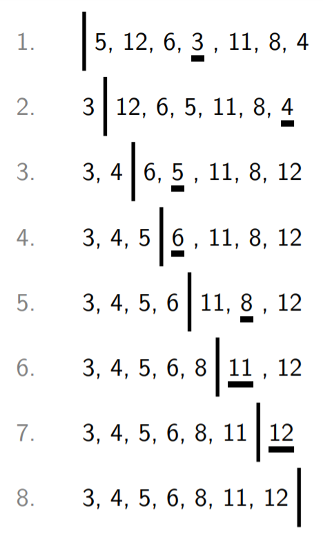

```csharp
public static int[] SelectionSort(int[] arr)
{
    int n = arr.Length;
    for (int i = 0; i < n - 1; ++i)
    {
        int k = i;
        for (int j = i + 1; j < n; ++j)
        {
            if (arr[j] < arr[k])
                k = j;
        }

        // Swap(arr[i], arr[k])
        int temp = arr[i];
        arr[i] = arr[k];
        arr[k] = temp;
    }
    return arr;
}
```

总结来说，对于数列，其从第 $0$ 位开始，在之后寻找最小位，然后与索引处进行替换。

### 复杂度

外层循环位 $n - 1$ 次  
在最坏情况，内层循环在第一次外层循环迭代 $n-1$ 次，在第二次外层循环迭代 $n-2$ ，以此类推。需要注意，这其实也是最佳，最差，和平均情况。

因此：

$$
\begin{aligned}
\sum^{n-2}_{i=0}\sum^{n-1}_{j=i+1}1 &= \sum^{n-2}_{i=0}(n-1-i)\\
&= (n-1)+\cdots+2+1\\
&= \cfrac{n(n-1)}{2}
\end{aligned}
$$

因此最佳，最坏和平均情况复杂度均为 $O(n^2)$。

### 稳定性

考虑一下当两个相同值的元素出现在要排序的数组中时会发生什么。

例如，考虑当输入数组包含 $2_1$，$2_2$，1时，下标表示值 2 的两个副本的出现顺序。

在第一遍中，我们找到最小的元素，在本例中是1，并将其与数组中的第一个元素 $2_1$ 交换。这就产生了 1、$2_2$、$2_1$。换句话说，2 的 2 个副本已经改变了顺序。

无论我们如何改变条件，在一组具有相同（最小）价值的元素中选择哪个元素，我们都可以很容易地产生反例，表明具有相同价值的元素的顺序可以改变。

因此，选择排序是不稳定的。

## Heap Sort (Selection)/堆排序

### 实现

一个优先堆结构允许在一个集合内高效选择并删除最高优先级。因此我们只需要将一个数列堆化，然后依次取出最高项即可。

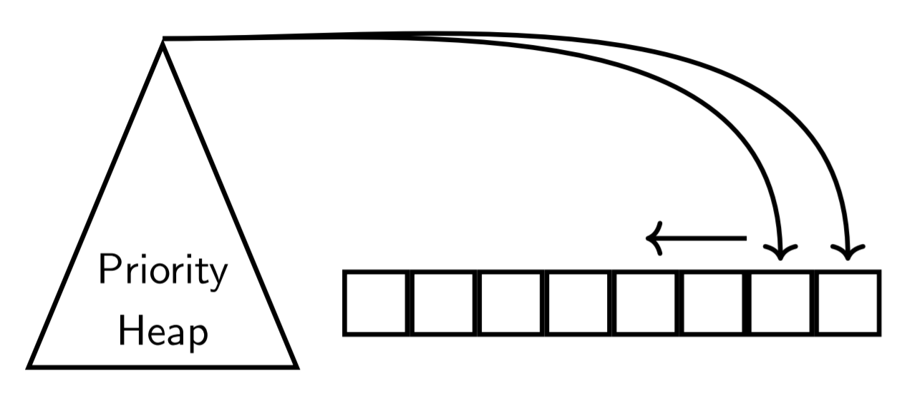


```csharp
public static HeapSort(int[] arr)
{
    int n = arr.Length;
    int[] h = Heapify(arr);
    for (int j = n; j > 1; --j)
    {
        // Swap(h[1], h[j])
        int temp = h[1];
        h[0] = h[j];
        h[j] = temp;

        BubbleDown(1, h, j-1);
    }
}
```

### 复杂度

Heapify 为 $O(n)$  
我们执行了 $n$ 次 BubbleDown 操作，每一个操作为 $O(\log n)$。  
因此合计复杂度 $O(n \log n)$。

### 稳定性

因为存在 BubbleDown 最高操作，所以排序是不稳定的。

## Merge Sort (Divide & Conquer)/归并排序

### 思路

1. 将数组对半拆分  
   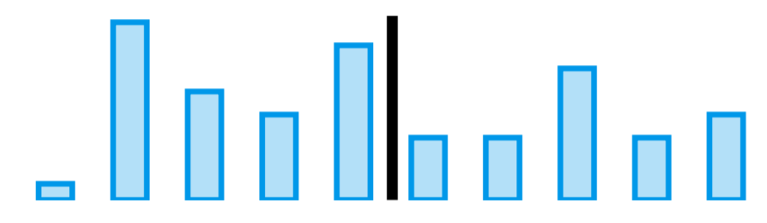
2. 依次对拆分的数组进行排序  
   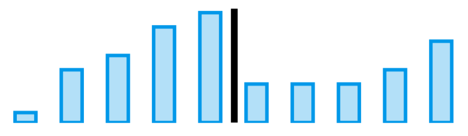
3. 合并两个排序好的数组  
   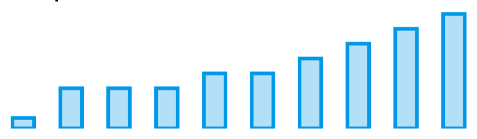

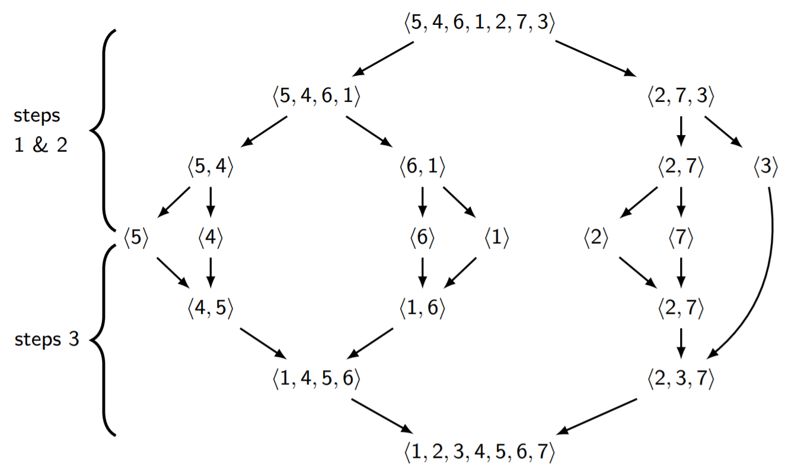


### 实现

```csharp
public static int[] MergeSort(int[] arr)
{
    int n = arr.Length;
    return MergeSort(arr, 0, n - 1);
}

private static int[] MergeSort(int[] arr, int left, int right)
{
    if (left < right)
    {
        int mid = (left + right) / 2;
        MergeSort(arr, left, mid);
        MergeSort(arr, mid + 1, right);

        return Merge(arr, left, mid, right);
    }
    return arr;
}

private static int[] Merge(int[] arr, int left, int mid, int right)
{
    int[] temp = new int[right - left + 1];
    int bCount = 0;
    int lCount = left;
    int rCount = mid + 1;

    while  ((lCount <= mid) && (rCount <= right))
    {
        if (arr[lCount] <= arr[rCount])
            temp[bCount++] = arr[lCount++];
        else
            temp[bCount++] = arr[rCount++];
    }

    if (lCount > mid)
    {
        while (rCount <= right)
        {
            temp[bCount++] = arr[rCount++];
        }
    }
    else
    {
        while (lCount <= mid)
        {
            temp[bCount++] = arr[lCount++];
        }
    }

    for (bCount = 0; bCount < right - left + 1; ++bCount)
    {
        arr[left + bCount] = temp[bCount];
    }
    return arr;
}
```

### 复杂度

合并长度为 $n_1$ 和 $n_2$ 的数列的复杂度为 $O(n_1+n_2)$。

递归调用的大小：

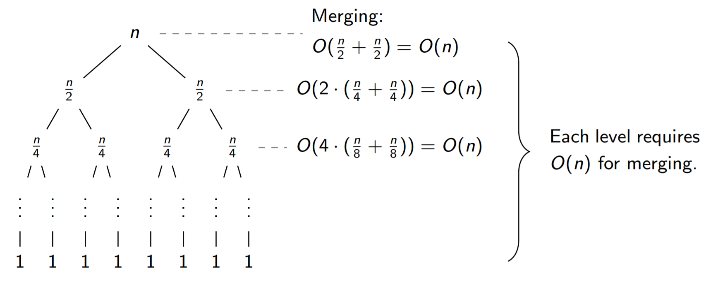

如果 $n=2^k$，那么我们就有 $k=\log_2{n}$ 层 $\Longrightarrow$ 因此复杂度为 $O(n \log n)$ （最好最坏和平均均为此）

### 稳定性

归并排序的的拆分阶段不改变任何项目的顺序。

只要合并阶段按顺序合并左边的和右边的，并且当值相等时，从最左边的子数组中取值，然后再从最右边的子数组中取值，那么值相同的不同元素也就不会改变它们的相对顺序。

因此归并排序是稳定的。

## Quick Sort (Divide & Conquer)/快速排序

### 思路

#### 排序

1. 选择数组总的一个选素，我们称其为 枢纽（pivot）
   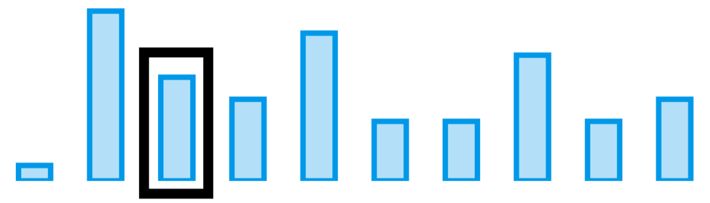
2. 对数组进行分区（partition）  
   小实体（small entries）（$\leq pivot$）在左侧
   大实体（large entries）（$> pivot$）在右侧
   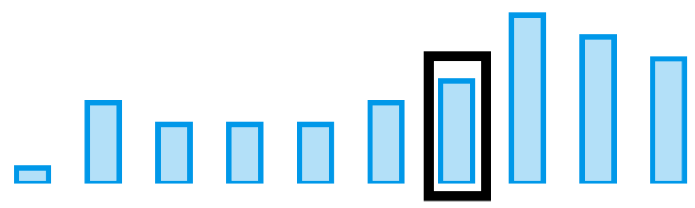
3. 对这两个分区进行递归快速排序
   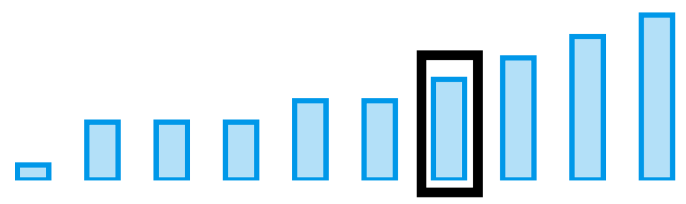

pivot 的选择对其至关重要。

**备注：** 为了使快速排序成为一种稳定的排序算法，允许大实体也 >= 枢轴是很有用的。

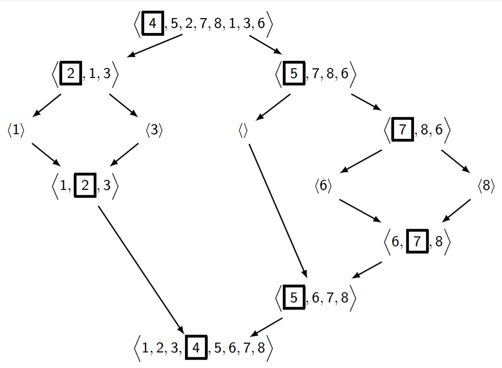

#### Partitioning/分区

##### 不稳定思路

先将 pivot 与数组最右侧元素交换。于是获得

```plain
[X][X][X][X][...][X][X][Pivot]
 ^ Prev is the rightest one
```

任何设定两个虚拟指针，分别从左向右和从右向左扫描。

当左侧出现 值 > pivot，右侧出现 值 < pivot 时，交换。

直到 左标记 > 右标记。

然后返回左标记。

需要注意的是，这里是严格 > 和严格 <。

##### 稳定思路

创建一个大小为 right - left + 1 的虚拟数组。

设定 2 个 Flag，记录 aCount 原始数组 arr，记录 bCount 记录 tmp。因此 aCount = left, bCount = 1。

从左开始扫描数组 arr。如果
- 索引位等于 pivotIndex，则存入 tmp[0]。
- 其值小于 pivot，则存入 arr[aCount++]。
- 其值等于 pivot 且其索引小于 pivotIndex 则存入 arr[aCount++]。
- 否则，存入 tmp[bCount++]。

最后，将 tmp 数组中的元素拷贝到 arr 中。（aCount 对应 0 索引）

返回 right - bCount + 1。

### 实现

```csharp
public static int[] QuickSort(int[] arr)
{
    int n = arr.Length;
    return QuickSort(arr, 0, n - 1);
}

public static int[] QuickSort(int[] arr, int left, int right)
{
    if (left < right)
    {
        int pivotIndex = Partition(arr, left, right);

        QuickSort(arr, left, pivotIndex - 1);
        QuickSort(arr, pivotIndex + 1, right);
    }
    return arr;
}

// This is unstable
// Also In-Place
public static int Partition(int[] arr, int left, int right)
{
    int pivotIndex = ChoosePivot(arr, left, right);
    int pivot = arr[pivotIndex];

    // Swap(arr[ivotIndex], arr[right]);
    int temp = arr[pivotIndex];
    arr[pivotIndex] = arr[right];
    arr[right] = temp;

    int leftMark = left;
    int rightMark = right - 1;
    while (leftMark <= rightMark)
    {
        while (leftMark <= rightMark
            && arr[leftMark] <= pivot)
        {
            ++leftMark;
        }
        while (leftMark <= rightMark
            && arr[right] >= pivot)
        {
            --rightMark;
        }
        if (leftMark < rightMark)
        {
            // Swap(arr[leftMark], arr[rightMark]);
            temp = arr[leftMark];
            arr[leftMark] = arr[rightMark];
            arr[rightMark] = temp;
            ++leftMark;
            --rightMark;
        }
    }
    // Swap(arr[leftMark], arr[right]);
    temp = arr[leftMark];
    arr[leftMark] = arr[right];
    arr[right] = temp;
    return leftMark;
}

// This is stable
// And require temp storage
private static int PartitionStable(int[] arr, int left, int right)
{
    int[] tmp = new int[right - left + 1];
    int pivotIndex = ChoosePivot(arr, left, right);
    int pivot = arr[pivotIndex];
    int aCount = left;
    int bCount = 1;

    for (int i = left; i <= right; ++i)
    {
        if (i == pivotIndex)
            tmp[0] = arr[i];
        else if (arr[i] < pivot ||
                (arr[i] == pivot && i < pivotIndex))
            arr[aCount++] = arr[i];
        else
            tmp[bCount++] = arr[i];
    }
    for (int i = 0; i < bCount; ++i)
    {
        arr[aCount++] = tmp[i];
    }
    return right - bCount + 1;
}

private static int ChoosePivot(int[] arr, int left, int right)
{
    return left;
}
```

## 非比较排序

### Binsort

Binsort 是一种排序方式，它不是基于键值之间的比较，而是仅仅基于记录的键值，将记录分配到 "仓 "中。

这些仓，用抽象数据类型的术语来说，是队列数据结构，它保持着记录被插入其中的顺序。

Binsort的最后一步是将队列串联起来，以得到一个单一的记录列表，其中有第一个仓的所有记录，然后是第二个仓的所有记录，等等。

Binsort 是一个稳定的排序，因为属于同一个 bin 的值是按照它们在输入中出现的顺序排队的。

Binsort 通过一次输入来填充仓，再通过一次仓来创建输出列表，所以这是 $O(n)$。

例如，用一副洗好的52张扑克牌，你可以把每张牌按面值分成13堆（A、2、3、...、J、Q、K）。每一堆，或者说每一个仓，最后都会有4张面值相同的牌，但是每一个仓里的花色（红心、方块、梅花、黑桃）还是会被混在一起。我们现在可以把所有的牌堆放在一起，组成一个由52张牌组成的单一牌堆，这些牌是按面值分类的，但不是按花色分类的。

如果我们现在对第一次分类得到的牌堆再做一次分类，但这次是基于花色而不是面值，你最终会得到4堆13张牌，每一种花色都有一个堆。这一次，由于 binsort 的稳定性，每堆牌将按面值排序：由于输入的牌是按面值排序的，所以牌将按面值顺序放入每个花色堆。

日期是适合做这种 "多阶段" binsort 的数值：先按日排序，然后按月排序，再按年排序，得到按年、月、日顺序排列的日期列表。
binsort 的一个变种是 bucketsort，它不是根据一个值（可以是数字或分类）将记录 "分散 "到 bins 中，而是根据一个数字范围或一组分类将它们分散到 buckets 中。

### Radix Sort

径向排序是一个多阶段的 binsort，在每个阶段排序的键是一个不同的、更重要的整数键的基数幂。例如，在基数（或弧度）10中，一个整数有单位的数字，10s，100s，1000s，等等。在 radix 排序中，首先对单位数位进行 binsort 排序，然后对10s数位进行排序，再对 100s 数位进行排序，等等。最后的结果是，键的排序首先是最重要的数字，然后是下一个最重要的数字，...。直到最后按最小有效数字排序。也就是说，它们将被排序为正常的整数顺序。


- 复杂度为 $O(kn)$，k为每个键的个数。
- 可以减少到 $O(\cfrac{kn}{m})$。通过把 $m$ 位的元素组合，并且使用 $2^m$ 个桶，例如 $m=4$，使用 $16$ 个桶。

### Pigeonhole Sort

一个特殊的情况是，要排序的键是 $0$ 到 $n-1$ 的数字。这听起来没有必要，也就是说，为什么不按 $0$ 到 $n-1$ 的顺序生成数字呢？但请记住，这些键通常只是记录中的字段，要求是将记录按键值顺序排列，而不仅仅是键值。

这里的想法是创建一个大小为 $n$ 的输出数组，然后迭代输入列表，直接将输入记录分配到输出数组中的正确位置。很明显，这是一个 $O(n)$。

```csharp
public static T[] PigeonholeSort<T>(T[] a)
{
    int n = a.Length;
    int[] b = new int[n];
    for (int i = 0; i < n; ++i)
        b[a[i].ToInt()] = a[i];

    for (int i = 0; i < n; ++i)
        a[i] = b[i];
    return b;
}
```

去避免重复覆盖，可以使用

```csharp
public static T[] PigeonholeSort<T>(T[] a)
{
    int n = a.Length;
    for (int i = 0; i < n; ++i)
        while (a[i].ToInt() != i)
        {
            // swap a[i] and a[a[i]]
            T tmp = a[i];
            a[i] = a[tmp.ToInt()];
            a[tmp.ToInt()] = tmp;
        }
```

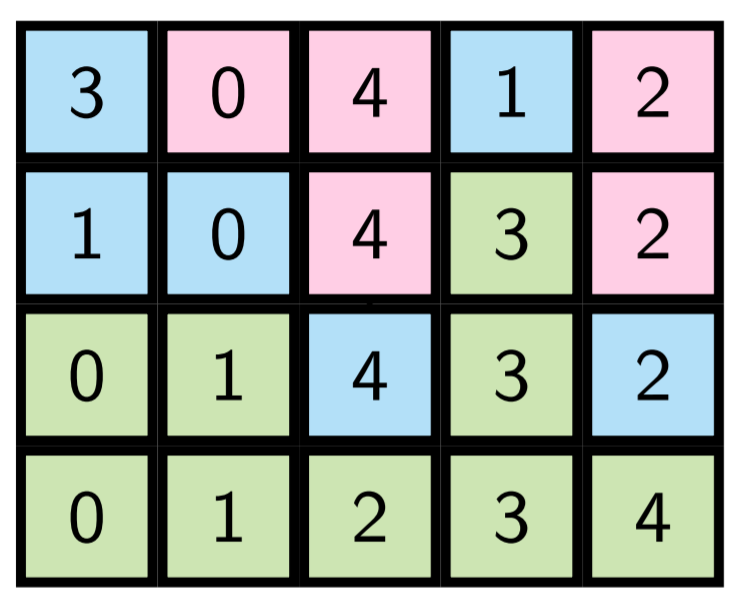

每次交换使一个键在正确的位置，因此最多有 $n - 1$ 次交换。因此时间复杂度为 $O(n)$。

## Summary

| 算法     | 思路      | 最坏情况      | 平均情况      | 稳定  |
| -------- | --------- | ------------- | ------------- | ----- |
| 冒泡排序 | Exchange  | $O(n^2)$      | $O(n^2)$      | Yes   |
| 选择排序 | Selection | $O(n^2)$      | $O(n^2)$      | No    |
| 插入排序 | Insertion | $O(n^2)$      | $O(n^2)$      | Yes   |
| 堆排序   | Selection | $O(n \log n)$ | $O(n \log n)$ | No    |
| 快速排序 | D & C     | $O(n^2)$      | $O(n \log n)$ | Maybe |
| 归并排序 | D & C     | $O(n \log n)$ | $O(n \log n)$ | Yes   |

| 算法      |  128 |  256 |  512 | 1024 | O1024 | R1024 |  2048 |
| --------- | ---: | ---: | ---: | ---: | ----: | ----: | ----: |
| 冒泡排序  |   54 |  221 |  881 | 3621 |  1285 |  5627 | 14497 |
| 选择排序  |   12 |   45 |  164 |  634 |   643 |   833 |  2497 |
| 插入排序  |   15 |   69 |  276 | 1137 |     6 |  2200 |  4536 |
| 堆排序    |   21 |   45 |  103 |  236 |   215 |   249 |   527 |
| 快速排序  |   12 |   27 |   55 |  112 |  1131 |  1200 |   230 |
| 快速排序2 |    6 |   12 |   24 |   57 |  1115 |  1191 |   134 |
| 归并排序  |   18 |   36 |   88 |  188 |   166 |   170 |   409 |
| 归并排序2 |    6 |   22 |   48 |  112 |    94 |    93 |   254 |

- 列标题显示被排序的项目数量
- O1024: 1024 个项目已按升序排列（ASC）
- R1024：1024 个项目已按降序排列（DESC）
- 快速排序 2 和 归并排序 2：一旦数组的大小下降到 16 或更小，在递归过程中排序就会切换到选择排序。
