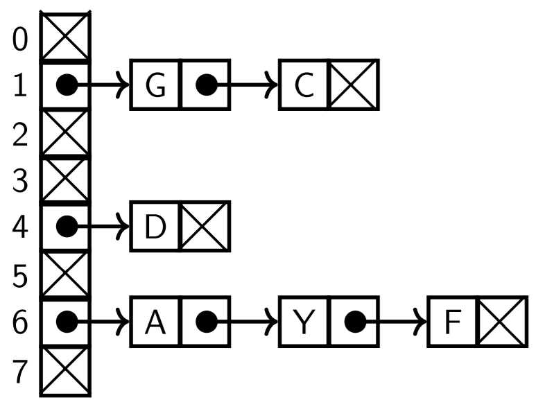
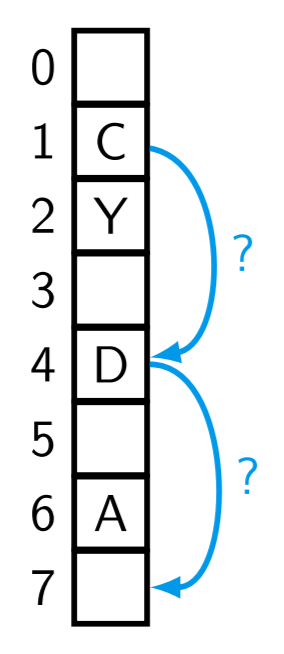
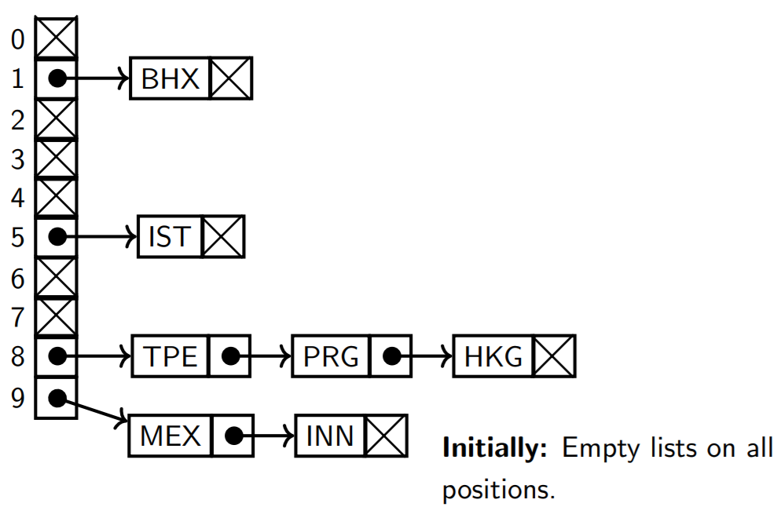
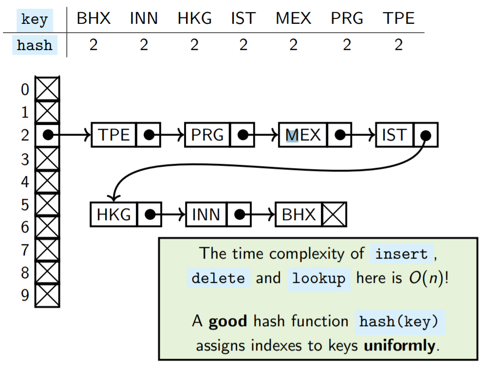
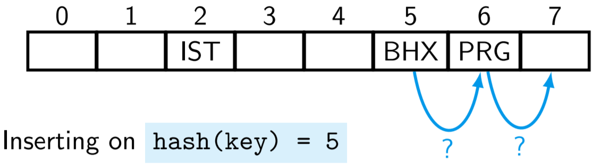
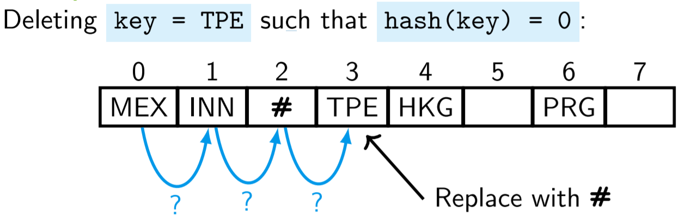
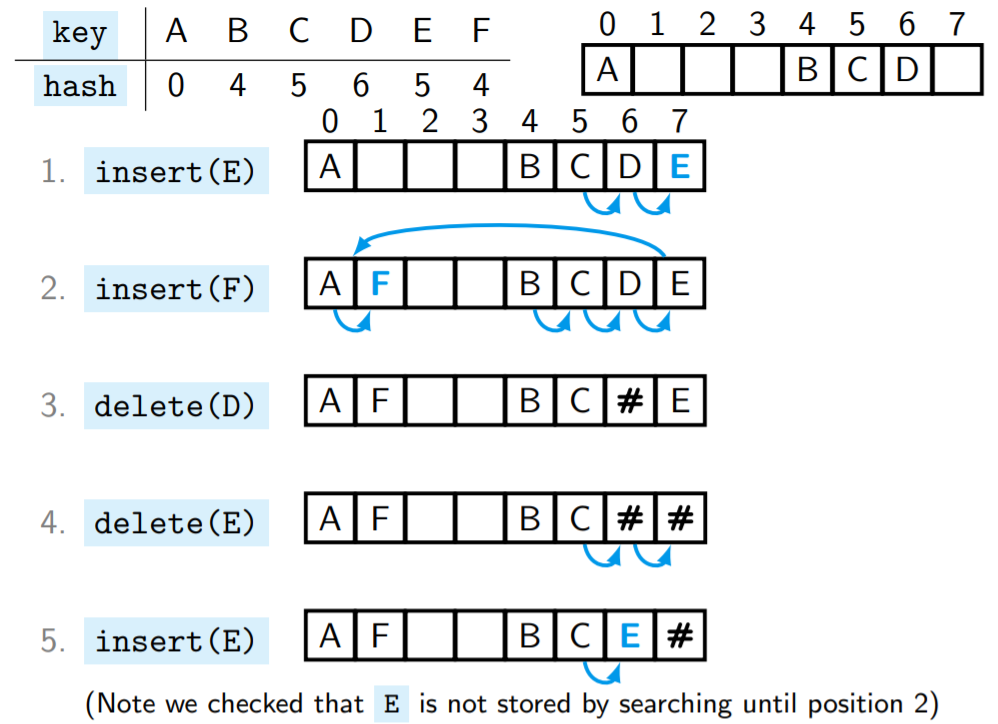
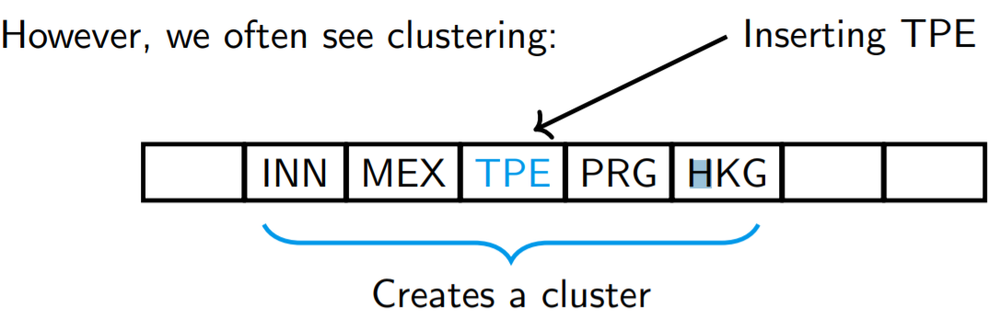
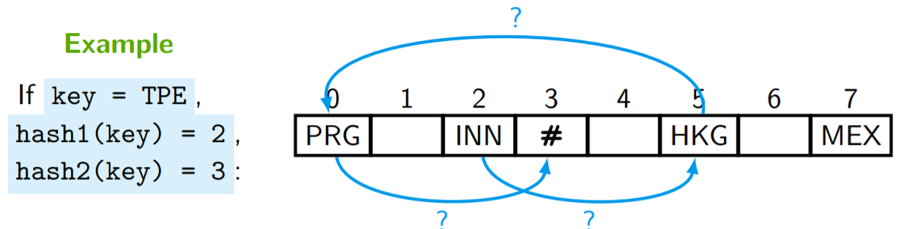
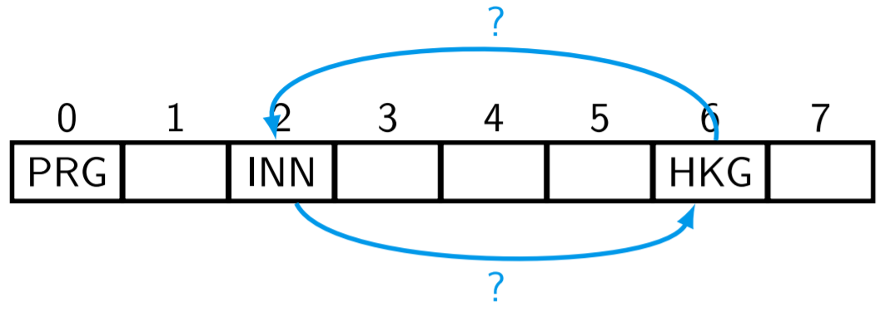

# HashTable/哈希表

05/01/2022
<a style="text-decoration:none; color: black;" href="https://github.com/KevinZonda">KevinZonda</a>

## Overview/总览

总的来说一个 HashTable 包含

1. 一个数组，用来存储数据
2. 一个 hash 函数 以及
3. 一个碰撞（collision）处理机制

因此必须实现：
- `set(key, value)`
- `delete(key)`
- `lookupValue(key)`

如果我们简化 key = value，则可以为
- `insert(key)`
- `delete(key)`
- `lookup(key)`

对于简化，除了更容易实现，还因为其很有用。参阅 HashSet。

注意：简化和未简化的解决方案区别在于一个只需要存储 key，而另一个需要存储两者。

两种哈希冲突处理方法

| Chaining Strategy 链式策略  | Open Addressing Strategy 开放式寻址策略       |
| ------------------------------ | ------------------------------------------------ |
|  |                    |
| 实体以相同的 `hash(key)` 存储  | 如果位置被使用，我们使用其它回落（fallback）地址 |

链式策略在哈希表的每个位置上存储一个额外的数据结构。这些可能是链表，另一个哈希表，甚至是完全不同的东西。在下文中，我们只考虑一种链式策略，称为直接链式，它使用链表来存储具有相同 `hash(key)` 的值。

开放式寻址策略的主要思想是，在发生碰撞的情况下，我们在同一个数组中找到一个不同的地址（从 "回落"地址序列中）来存储碰撞的值，也就是一个目前未使用的地址，或者说是 "开放的"，因此被称为开放寻址。在本模块中，我们考虑以下两种开放寻址策略。

- 线性探测
- 双重散列

## Hash Collision/哈希碰撞

### Direct Chaining/直接链式

例如机场代码 BHX, INN, HKG, IST  
Table Size: 10

我们可以吧第一个字母看成 hash （A=0，B=1 ... Z=25）  
换句话说，我们可以认为其为 26 进制。  
$ABC = (A\times 26^2+B\times 26^1+C\times 26^0)$  
我们的 `hashcode` 以 `mod 10` 为基础
那么 BHX =  1\*26\*26 + 7\*26 + 23=881  
hash(BHX) = 881 % 10 = 1

于是我们获得了

| `key`  | BHX | INN | HKG | IST | MEX | PRG | TPE |
| ------ | --- | --- | --- | --- | --- | --- | --- |
| `hash` | 1   | 9   | 8   | 5   | 9   | 8   | 8   |

不良好的哈希算法，因为它们可能会导致碰撞。

在插入新 `key` 时，需要检查是否存在这个 `key`，因此需要遍历 `hash(key)` 位置的链表，其具有 O(n) 复杂度。

与此同时，`delete` 和 `lookup` 也是 O(n)。

因此我们需要一个更好的散列函数，以 uniformly 分布 `key` 在不同位置。

#### 时间复杂度

负载因子（load factor）：HashTable **平均** 在同一个位置存储的实体数量

$$
\text{load factor}= \cfrac{n}{T}
$$

n：哈希表中的总实体数  
T：哈希表的大小

例如我们有4个数据，其散列到10个 `hash(key)` 中，则负载因子为 0.4（4/10）。

如果我们拥有一个良好的散列函数，每个 `hash(key)` 的位置所预期存储实体的数量应该为 n/T。

不成功的 `lookup` 操作
- `key` 不在表中
- `hash(key)` 处平均存储了 n/T 个实体
- 但是我们必须穿过他们

负载系数代表哈希表的满度。假设我们有一个好的哈希函数，负载系数 0.25 代表得到碰撞的概率为 25%。

有一个好的哈希函数的结果是，对于一个随机选择的密钥，在 `hash(key)` 位置上的链接列表具有预期长度 `n/T`。

直观地说，它意味着存储在 `hash(key)` 位置上的列表可能更长，也可能更短，但它的长度很可能大约是 `n/T`（对于一个随机选择的密钥）。

对于一个成功的 `lookup` 操作
- `hash(key)` 处平均存储了 `n/T` 个实体
- 平均来说，对于一个 `k` 元素的线性查找，我们需要进行 $\cfrac{1}{k}(1+2+\cdots+k)=\cfrac{k(k+1)}{2k}=\cfrac{(k+1)}{2}$ 次对比

> 我们可以假设 最大负载因子（Maximal Load Factor） $\lambda$，$\cfrac{n}{T}\leq \lambda$  
> 在 Java，$\lambda=0.75$

对于平均情况
- 不成功的 `lookup` 进行 $\cfrac{n}{T} \leq \lambda$ 次对比，因此为 O(1)
- 成功的 `lookup`，需要进行 $\cfrac{1}{2}(1+\cfrac{n}{T})\leq\cfrac{1}{2}(1+\lambda)$，因此为 O(1)

对于插入 `key`
- 先检查 `key` 是否在表中
- 如果不在，则存储在 `hash(key)` 中

因此需要进行

$\cfrac{n}{T}+1\leq \lambda+1\Longrightarrow O(1)$

`delete` 的复杂度与成功 `lookup` 相同。

#### 缺陷

- 有很多 `hash` 冲突，所以有很多未使用的空间
- LinkedList 需要很多次分配空间，它们很慢

### Linear Probing/线性探测

#### 插入

**最初思路：** 如果初始位置 `hash(key)` 被占用了，则寻找之后第一个空位，然后插入。如果到达底部，则从头开始。

我们使用 `mod` 来进行回落操作

`hash(key) + M % T`

#### 删除

**思路：**
1. 寻找 `key` 位置  
   1. 寻找 `hash(key)`
   2. 向右探测，直到 key 或者一个空位被找到
2. 如果 key 被存储在表中，使用一个墓碑（tombstone。被标记为#）

#### 搜索

- 从主位置 `hash(key)` 开始，搜索右边的键。跳过所有的墓碑。
- 如果我们到达一个空的位置，那么这个键就不在表中。

#### 插入（精确）

- 像上面一样搜索 `hash(key)`，记录
- 如果存在的话，记录第一个墓碑的位置
- 如果我们找到了 `key`，就发出错误信号
- 如果我们到达一个空位置，那么键不在表
- 如果有墓碑的记录，则在记录的墓碑位置插入键，否则在发现的空位置插入。

**注意：** 每个位置要么是空的，要么是储存了一个墓碑或一个 `key`。此外，最初，所有的位置都被标记为空。

#### 时间复杂度

`insert`, `search`, `delete` 时间复杂度均为 O(1)

进关看上去复杂度很低，但是我们会经常看见集群情况：

#### 缺陷

初级集群（Primary clusters）是由具有相同哈希代码的条目引起的集群。

二级集群（Secondary clusters）是当碰撞处理策略导致不同的条目在碰撞时检查相同的位置序列时引起的。

集群更有可能变得越来越大，即使负载因子很小。

### Double Hashing/双重哈希

分别使用初级（primary）和次级（secondary）哈希算法。

#### 插入

我们首先使用初级哈希算法算出 `hash1(key)`，如果在 `hash1(key)` 处有记录，我们使用回落：
1. `(hash1(key) + 1*hash2(key)) % T`
1. `(hash1(key) + 2*hash2(key)) % T`
1. `(hash1(key) + 3*hash2(key)) % T`
1. `(hash1(key) + 4*hash2(key)) % T`

T：表的大小

直到找到合适位置 

双重哈希是线性探测的一个提升。不同点进士形成回落数列时，差值一个为 `hash2`, 一个为 1。

因此除了回落操作不同，其余操作均使用相同方式工作。

#### Avoiding Short Cycles/避免短回环

思考：`hash1(key)=2`, `hash2(key)=4`, `T = 0`

**两种解决方法：**

- 让 T 为素数
- T = 2^k 并且 `hash2(key)` 永远产生 奇数

## 一些问题

### 高负载因子或表满了

$$
\cfrac{n}{T}>\lambda
$$

**思路：** Rehashing！

如果在插入一次吼，表满了，则创建一个大小为之前 2 倍的表，并重新插入之前的元素。

最差情况是 O(n)，但是均摊情况为 O(1)。

（2 倍的优势是和 T = 2^k 以避免短回环非常有效）

需要注意，更改表大小后，需要重新调整hash算法，通常来说

$$
\text{hash}(key)=\text{bigHash}(key) \bmod T
$$

在扩容后

$$
\text{hash}(key)=\text{bigHash}(key) \bmod (2\times T)
$$

## 总结

所有操作的均摊复杂度均为 O(1)，如果
- `hash1` （和`hash2`）计算索引离散的
- 当表满时，rehash
- （T=2^k，并且 `hash2()` 给出奇数）

### 对比树

AVL 树的操作均为 O(log n)。

- 插入,删除,搜索，无论在 Direct Chaining, Linear Probing 还是 Double Hashing 均为 O(1)
- 双哈希具有性能优势（因为不需要频繁分配内存）
- 在链式计算中，如果负载率下降到最低阈值以下，我们可以将其重新散列到一半大小的哈希表中。这很少做，因为它不能加快性能。
- 在开放寻址哈希表中，我们跟踪表中的墓碑数量。如果超过了某个阈值，我们也会重新洗牌，但不会使大小翻倍。如果有很多墓碑，我们甚至可以将哈希表的大小减半。